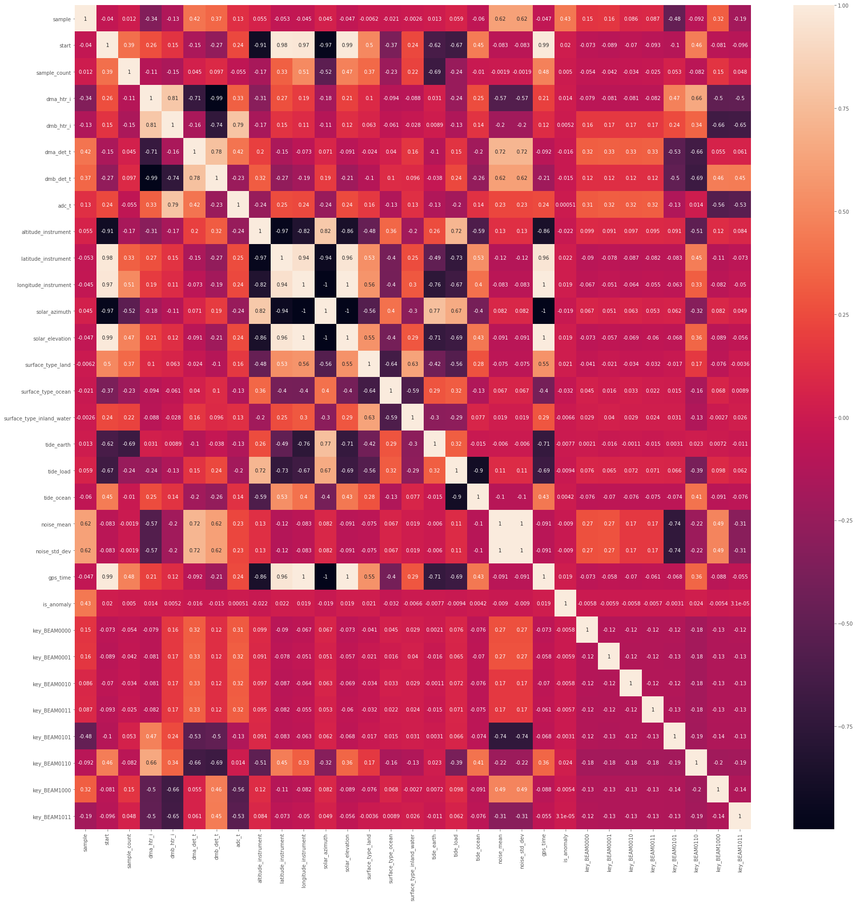
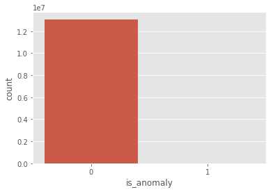
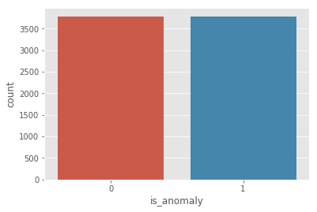

# Jake Cupani
# INST414
# Final Project

# Detecting Radiation Events from the NASA GEDI Satellite

# Imports


```python
import h5py
import matplotlib.pyplot as plt
import pandas as pd
from sklearn.metrics import confusion_matrix
from sklearn.model_selection import train_test_split
from sklearn.neighbors import KNeighborsClassifier
from sklearn.naive_bayes import GaussianNB
from sklearn.ensemble import RandomForestClassifier
from sklearn.linear_model import LogisticRegression
from sklearn.naive_bayes import GaussianNB
from collections import Counter
from imblearn.metrics import classification_report_imbalanced
from sklearn.metrics import precision_score, recall_score, f1_score, roc_auc_score, accuracy_score, classification_report
import numpy as np
import datetime
import seaborn as sn
pd.set_option('display.float_format', lambda x: '%.5f' % x)
plt.style.use("ggplot")
```

# Data Collection & Manipulation


```python
# In order to read in the HDF file, we need to use h5py
with h5py.File('GEDI01_A_2019214130032_O03613_T05061_02_003_01.h5', 'r') as f:    
    keys = ['BEAM0000', 'BEAM0001', 'BEAM0010', 'BEAM0011', 'BEAM0101', 'BEAM0110', 'BEAM1000', 'BEAM1011']
    for key in keys:
        data = f[key]
        df_list = []
        sample_length = int(len(data['rx_sample_start_index'])/10)
        random_sample = random.sample(range(1, len(data['rx_sample_start_index'])), sample_length)

        for i in tqdmn(range(sample_length)):
            
            # Only get samples that are within our random sample
            if i not in random_sample:
                continue
            
            start = int(data['rx_sample_start_index'][i])-1
            sample_count = int(data['rx_sample_count'][i])
            
            # Select data from start index to start + sample_count since padded by zeroes
            sample = list(data['rxwaveform'][start:start+sample_count])

            df = pd.DataFrame()
            df['sample'] = sample
            df['start'] = [start] * len(sample)
            df['sample_count'] = [sample_count] * len(sample)

            df['dma_htr_i'] = [data['INST_HK']['dma_htr_i'][i]] * len(sample)
            df['dmb_htr_i'] = [data["INST_HK"]['dmb_htr_i'][i]] * len(sample)
            df['dma_det_t'] = [data['INST_HK']['dma_det_t'][i]] * len(sample)
            df['dmb_det_t'] = [data['INST_HK']['dmb_det_t'][i]] * len(sample)
            df['adc_t'] = [data['INST_HK']['adc_t'][i]] * len(sample)
            
            df['altitude_instrument'] = [data['geolocation']['altitude_instrument'][i]] * len(sample)
            df['latitude_instrument'] = [data['geolocation']['latitude_instrument'][i]] * len(sample)
            df['longitude_instrument'] = [data['geolocation']['longitude_instrument'][i]] * len(sample)
            
            
            df['solar_azimuth'] = [data['geolocation']['solar_azimuth'][i]] * len(sample)
            df['solar_elevation'] = [data['geolocation']['solar_elevation'][i]] * len(sample)
            
            surface_type = data['geolocation']['surface_type']
            df['surface_type_land'] = [surface_type[0][i]] * len(sample)
            df['surface_type_ocean'] = [surface_type[1][i]] * len(sample)
            df['surface_type_inland_water'] = [surface_type[3][i]] * len(sample)

            df['tide_earth'] = [data['geophys_corr']['tide_earth'][i]] * len(sample)
            df['tide_load'] = [data['geophys_corr']['tide_load'][i]] * len(sample)
            df['tide_ocean'] = [data['geophys_corr']['tide_ocean'][i]] * len(sample)


            df['noise_mean'] = [data['noise_mean'][i]] * len(sample)
            df['noise_std_dev'] = [data['noise_mean'][i]] * len(sample)
            
            df['gps_time'] = [data['gps_time'][i]] * len(sample)
            df['datetime'] = [time.ctime(i) for i in df['gps_time']]
            df['detector'] = [key] * len(sample)
            
            df_list.append(df)
        
    df = pd.concat(df_list)
    df = pd.get_dummies(dataset, columns=["key"])
    df = df.drop('key',axis=1)
    df['is_anomaly'] = np.where(df['sample'] > df['noise_mean'] + 4 * df['noise_std_dev'],1,0)
    
    df.to_csv("dataset_final.csv",index=False)
    print(df)
```


```python
# In this case, I am just reading in the data I have collected from the previous cell to save time.
# This dataset can be found at: 
# https://drive.google.com/open?id=1iSes8WWyPxizxsKPjcvb_-FvZt5dZ8F1

dataset = pd.read_csv("dataset_final.csv")

# In order to flag the anomalies, we look for samples that are greater than 2 standard deviations away from the noise mean
dataset['is_anomaly'] = np.where(dataset['sample'] > dataset['noise_mean'] + 2 * dataset['noise_std_dev'],1,0)

# Create dummy variables for the key variable (detector) and drop original column
dataset = pd.get_dummies(dataset, columns=["key"])
dataset
```


<div>
<style scoped>
    .dataframe tbody tr th:only-of-type {
        vertical-align: middle;
    }

    .dataframe tbody tr th {
        vertical-align: top;
    }

    .dataframe thead th {
        text-align: right;
    }
</style>
<table border="1" class="dataframe">
  <thead>
    <tr style="text-align: right;">
      <th></th>
      <th>sample</th>
      <th>start</th>
      <th>sample_count</th>
      <th>dma_htr_i</th>
      <th>dmb_htr_i</th>
      <th>dma_det_t</th>
      <th>dmb_det_t</th>
      <th>adc_t</th>
      <th>altitude_instrument</th>
      <th>latitude_instrument</th>
      <th>...</th>
      <th>datetime</th>
      <th>is_anomaly</th>
      <th>key_BEAM0000</th>
      <th>key_BEAM0001</th>
      <th>key_BEAM0010</th>
      <th>key_BEAM0011</th>
      <th>key_BEAM0101</th>
      <th>key_BEAM0110</th>
      <th>key_BEAM1000</th>
      <th>key_BEAM1011</th>
    </tr>
  </thead>
  <tbody>
    <tr>
      <th>0</th>
      <td>247</td>
      <td>25560</td>
      <td>101</td>
      <td>88.26531</td>
      <td>88.23342</td>
      <td>66.41389</td>
      <td>69.02371</td>
      <td>44.71910</td>
      <td>429344.72732</td>
      <td>-51.79367</td>
      <td>...</td>
      <td>Tue Jul 28 09:00:42 2009</td>
      <td>0</td>
      <td>1</td>
      <td>0</td>
      <td>0</td>
      <td>0</td>
      <td>0</td>
      <td>0</td>
      <td>0</td>
      <td>0</td>
    </tr>
    <tr>
      <th>1</th>
      <td>244</td>
      <td>25560</td>
      <td>101</td>
      <td>88.26531</td>
      <td>88.23342</td>
      <td>66.41389</td>
      <td>69.02371</td>
      <td>44.71910</td>
      <td>429344.72732</td>
      <td>-51.79367</td>
      <td>...</td>
      <td>Tue Jul 28 09:00:42 2009</td>
      <td>0</td>
      <td>1</td>
      <td>0</td>
      <td>0</td>
      <td>0</td>
      <td>0</td>
      <td>0</td>
      <td>0</td>
      <td>0</td>
    </tr>
    <tr>
      <th>2</th>
      <td>239</td>
      <td>25560</td>
      <td>101</td>
      <td>88.26531</td>
      <td>88.23342</td>
      <td>66.41389</td>
      <td>69.02371</td>
      <td>44.71910</td>
      <td>429344.72732</td>
      <td>-51.79367</td>
      <td>...</td>
      <td>Tue Jul 28 09:00:42 2009</td>
      <td>0</td>
      <td>1</td>
      <td>0</td>
      <td>0</td>
      <td>0</td>
      <td>0</td>
      <td>0</td>
      <td>0</td>
      <td>0</td>
    </tr>
    <tr>
      <th>3</th>
      <td>242</td>
      <td>25560</td>
      <td>101</td>
      <td>88.26531</td>
      <td>88.23342</td>
      <td>66.41389</td>
      <td>69.02371</td>
      <td>44.71910</td>
      <td>429344.72732</td>
      <td>-51.79367</td>
      <td>...</td>
      <td>Tue Jul 28 09:00:42 2009</td>
      <td>0</td>
      <td>1</td>
      <td>0</td>
      <td>0</td>
      <td>0</td>
      <td>0</td>
      <td>0</td>
      <td>0</td>
      <td>0</td>
    </tr>
    <tr>
      <th>4</th>
      <td>245</td>
      <td>25560</td>
      <td>101</td>
      <td>88.26531</td>
      <td>88.23342</td>
      <td>66.41389</td>
      <td>69.02371</td>
      <td>44.71910</td>
      <td>429344.72732</td>
      <td>-51.79367</td>
      <td>...</td>
      <td>Tue Jul 28 09:00:42 2009</td>
      <td>0</td>
      <td>1</td>
      <td>0</td>
      <td>0</td>
      <td>0</td>
      <td>0</td>
      <td>0</td>
      <td>0</td>
      <td>0</td>
    </tr>
    <tr>
      <th>5</th>
      <td>243</td>
      <td>25560</td>
      <td>101</td>
      <td>88.26531</td>
      <td>88.23342</td>
      <td>66.41389</td>
      <td>69.02371</td>
      <td>44.71910</td>
      <td>429344.72732</td>
      <td>-51.79367</td>
      <td>...</td>
      <td>Tue Jul 28 09:00:42 2009</td>
      <td>0</td>
      <td>1</td>
      <td>0</td>
      <td>0</td>
      <td>0</td>
      <td>0</td>
      <td>0</td>
      <td>0</td>
      <td>0</td>
    </tr>
    <tr>
      <th>6</th>
      <td>247</td>
      <td>25560</td>
      <td>101</td>
      <td>88.26531</td>
      <td>88.23342</td>
      <td>66.41389</td>
      <td>69.02371</td>
      <td>44.71910</td>
      <td>429344.72732</td>
      <td>-51.79367</td>
      <td>...</td>
      <td>Tue Jul 28 09:00:42 2009</td>
      <td>0</td>
      <td>1</td>
      <td>0</td>
      <td>0</td>
      <td>0</td>
      <td>0</td>
      <td>0</td>
      <td>0</td>
      <td>0</td>
    </tr>
    <tr>
      <th>7</th>
      <td>248</td>
      <td>25560</td>
      <td>101</td>
      <td>88.26531</td>
      <td>88.23342</td>
      <td>66.41389</td>
      <td>69.02371</td>
      <td>44.71910</td>
      <td>429344.72732</td>
      <td>-51.79367</td>
      <td>...</td>
      <td>Tue Jul 28 09:00:42 2009</td>
      <td>0</td>
      <td>1</td>
      <td>0</td>
      <td>0</td>
      <td>0</td>
      <td>0</td>
      <td>0</td>
      <td>0</td>
      <td>0</td>
    </tr>
    <tr>
      <th>8</th>
      <td>248</td>
      <td>25560</td>
      <td>101</td>
      <td>88.26531</td>
      <td>88.23342</td>
      <td>66.41389</td>
      <td>69.02371</td>
      <td>44.71910</td>
      <td>429344.72732</td>
      <td>-51.79367</td>
      <td>...</td>
      <td>Tue Jul 28 09:00:42 2009</td>
      <td>0</td>
      <td>1</td>
      <td>0</td>
      <td>0</td>
      <td>0</td>
      <td>0</td>
      <td>0</td>
      <td>0</td>
      <td>0</td>
    </tr>
    <tr>
      <th>9</th>
      <td>248</td>
      <td>25560</td>
      <td>101</td>
      <td>88.26531</td>
      <td>88.23342</td>
      <td>66.41389</td>
      <td>69.02371</td>
      <td>44.71910</td>
      <td>429344.72732</td>
      <td>-51.79367</td>
      <td>...</td>
      <td>Tue Jul 28 09:00:42 2009</td>
      <td>0</td>
      <td>1</td>
      <td>0</td>
      <td>0</td>
      <td>0</td>
      <td>0</td>
      <td>0</td>
      <td>0</td>
      <td>0</td>
    </tr>
    <tr>
      <th>10</th>
      <td>243</td>
      <td>25560</td>
      <td>101</td>
      <td>88.26531</td>
      <td>88.23342</td>
      <td>66.41389</td>
      <td>69.02371</td>
      <td>44.71910</td>
      <td>429344.72732</td>
      <td>-51.79367</td>
      <td>...</td>
      <td>Tue Jul 28 09:00:42 2009</td>
      <td>0</td>
      <td>1</td>
      <td>0</td>
      <td>0</td>
      <td>0</td>
      <td>0</td>
      <td>0</td>
      <td>0</td>
      <td>0</td>
    </tr>
    <tr>
      <th>11</th>
      <td>248</td>
      <td>25560</td>
      <td>101</td>
      <td>88.26531</td>
      <td>88.23342</td>
      <td>66.41389</td>
      <td>69.02371</td>
      <td>44.71910</td>
      <td>429344.72732</td>
      <td>-51.79367</td>
      <td>...</td>
      <td>Tue Jul 28 09:00:42 2009</td>
      <td>0</td>
      <td>1</td>
      <td>0</td>
      <td>0</td>
      <td>0</td>
      <td>0</td>
      <td>0</td>
      <td>0</td>
      <td>0</td>
    </tr>
    <tr>
      <th>12</th>
      <td>249</td>
      <td>25560</td>
      <td>101</td>
      <td>88.26531</td>
      <td>88.23342</td>
      <td>66.41389</td>
      <td>69.02371</td>
      <td>44.71910</td>
      <td>429344.72732</td>
      <td>-51.79367</td>
      <td>...</td>
      <td>Tue Jul 28 09:00:42 2009</td>
      <td>0</td>
      <td>1</td>
      <td>0</td>
      <td>0</td>
      <td>0</td>
      <td>0</td>
      <td>0</td>
      <td>0</td>
      <td>0</td>
    </tr>
    <tr>
      <th>13</th>
      <td>249</td>
      <td>25560</td>
      <td>101</td>
      <td>88.26531</td>
      <td>88.23342</td>
      <td>66.41389</td>
      <td>69.02371</td>
      <td>44.71910</td>
      <td>429344.72732</td>
      <td>-51.79367</td>
      <td>...</td>
      <td>Tue Jul 28 09:00:42 2009</td>
      <td>0</td>
      <td>1</td>
      <td>0</td>
      <td>0</td>
      <td>0</td>
      <td>0</td>
      <td>0</td>
      <td>0</td>
      <td>0</td>
    </tr>
    <tr>
      <th>14</th>
      <td>245</td>
      <td>25560</td>
      <td>101</td>
      <td>88.26531</td>
      <td>88.23342</td>
      <td>66.41389</td>
      <td>69.02371</td>
      <td>44.71910</td>
      <td>429344.72732</td>
      <td>-51.79367</td>
      <td>...</td>
      <td>Tue Jul 28 09:00:42 2009</td>
      <td>0</td>
      <td>1</td>
      <td>0</td>
      <td>0</td>
      <td>0</td>
      <td>0</td>
      <td>0</td>
      <td>0</td>
      <td>0</td>
    </tr>
    <tr>
      <th>15</th>
      <td>246</td>
      <td>25560</td>
      <td>101</td>
      <td>88.26531</td>
      <td>88.23342</td>
      <td>66.41389</td>
      <td>69.02371</td>
      <td>44.71910</td>
      <td>429344.72732</td>
      <td>-51.79367</td>
      <td>...</td>
      <td>Tue Jul 28 09:00:42 2009</td>
      <td>0</td>
      <td>1</td>
      <td>0</td>
      <td>0</td>
      <td>0</td>
      <td>0</td>
      <td>0</td>
      <td>0</td>
      <td>0</td>
    </tr>
    <tr>
      <th>16</th>
      <td>244</td>
      <td>25560</td>
      <td>101</td>
      <td>88.26531</td>
      <td>88.23342</td>
      <td>66.41389</td>
      <td>69.02371</td>
      <td>44.71910</td>
      <td>429344.72732</td>
      <td>-51.79367</td>
      <td>...</td>
      <td>Tue Jul 28 09:00:42 2009</td>
      <td>0</td>
      <td>1</td>
      <td>0</td>
      <td>0</td>
      <td>0</td>
      <td>0</td>
      <td>0</td>
      <td>0</td>
      <td>0</td>
    </tr>
    <tr>
      <th>17</th>
      <td>249</td>
      <td>25560</td>
      <td>101</td>
      <td>88.26531</td>
      <td>88.23342</td>
      <td>66.41389</td>
      <td>69.02371</td>
      <td>44.71910</td>
      <td>429344.72732</td>
      <td>-51.79367</td>
      <td>...</td>
      <td>Tue Jul 28 09:00:42 2009</td>
      <td>0</td>
      <td>1</td>
      <td>0</td>
      <td>0</td>
      <td>0</td>
      <td>0</td>
      <td>0</td>
      <td>0</td>
      <td>0</td>
    </tr>
    <tr>
      <th>18</th>
      <td>240</td>
      <td>25560</td>
      <td>101</td>
      <td>88.26531</td>
      <td>88.23342</td>
      <td>66.41389</td>
      <td>69.02371</td>
      <td>44.71910</td>
      <td>429344.72732</td>
      <td>-51.79367</td>
      <td>...</td>
      <td>Tue Jul 28 09:00:42 2009</td>
      <td>0</td>
      <td>1</td>
      <td>0</td>
      <td>0</td>
      <td>0</td>
      <td>0</td>
      <td>0</td>
      <td>0</td>
      <td>0</td>
    </tr>
    <tr>
      <th>19</th>
      <td>247</td>
      <td>25560</td>
      <td>101</td>
      <td>88.26531</td>
      <td>88.23342</td>
      <td>66.41389</td>
      <td>69.02371</td>
      <td>44.71910</td>
      <td>429344.72732</td>
      <td>-51.79367</td>
      <td>...</td>
      <td>Tue Jul 28 09:00:42 2009</td>
      <td>0</td>
      <td>1</td>
      <td>0</td>
      <td>0</td>
      <td>0</td>
      <td>0</td>
      <td>0</td>
      <td>0</td>
      <td>0</td>
    </tr>
    <tr>
      <th>20</th>
      <td>244</td>
      <td>25560</td>
      <td>101</td>
      <td>88.26531</td>
      <td>88.23342</td>
      <td>66.41389</td>
      <td>69.02371</td>
      <td>44.71910</td>
      <td>429344.72732</td>
      <td>-51.79367</td>
      <td>...</td>
      <td>Tue Jul 28 09:00:42 2009</td>
      <td>0</td>
      <td>1</td>
      <td>0</td>
      <td>0</td>
      <td>0</td>
      <td>0</td>
      <td>0</td>
      <td>0</td>
      <td>0</td>
    </tr>
    <tr>
      <th>21</th>
      <td>246</td>
      <td>25560</td>
      <td>101</td>
      <td>88.26531</td>
      <td>88.23342</td>
      <td>66.41389</td>
      <td>69.02371</td>
      <td>44.71910</td>
      <td>429344.72732</td>
      <td>-51.79367</td>
      <td>...</td>
      <td>Tue Jul 28 09:00:42 2009</td>
      <td>0</td>
      <td>1</td>
      <td>0</td>
      <td>0</td>
      <td>0</td>
      <td>0</td>
      <td>0</td>
      <td>0</td>
      <td>0</td>
    </tr>
    <tr>
      <th>22</th>
      <td>247</td>
      <td>25560</td>
      <td>101</td>
      <td>88.26531</td>
      <td>88.23342</td>
      <td>66.41389</td>
      <td>69.02371</td>
      <td>44.71910</td>
      <td>429344.72732</td>
      <td>-51.79367</td>
      <td>...</td>
      <td>Tue Jul 28 09:00:42 2009</td>
      <td>0</td>
      <td>1</td>
      <td>0</td>
      <td>0</td>
      <td>0</td>
      <td>0</td>
      <td>0</td>
      <td>0</td>
      <td>0</td>
    </tr>
    <tr>
      <th>23</th>
      <td>253</td>
      <td>25560</td>
      <td>101</td>
      <td>88.26531</td>
      <td>88.23342</td>
      <td>66.41389</td>
      <td>69.02371</td>
      <td>44.71910</td>
      <td>429344.72732</td>
      <td>-51.79367</td>
      <td>...</td>
      <td>Tue Jul 28 09:00:42 2009</td>
      <td>0</td>
      <td>1</td>
      <td>0</td>
      <td>0</td>
      <td>0</td>
      <td>0</td>
      <td>0</td>
      <td>0</td>
      <td>0</td>
    </tr>
    <tr>
      <th>24</th>
      <td>252</td>
      <td>25560</td>
      <td>101</td>
      <td>88.26531</td>
      <td>88.23342</td>
      <td>66.41389</td>
      <td>69.02371</td>
      <td>44.71910</td>
      <td>429344.72732</td>
      <td>-51.79367</td>
      <td>...</td>
      <td>Tue Jul 28 09:00:42 2009</td>
      <td>0</td>
      <td>1</td>
      <td>0</td>
      <td>0</td>
      <td>0</td>
      <td>0</td>
      <td>0</td>
      <td>0</td>
      <td>0</td>
    </tr>
    <tr>
      <th>25</th>
      <td>254</td>
      <td>25560</td>
      <td>101</td>
      <td>88.26531</td>
      <td>88.23342</td>
      <td>66.41389</td>
      <td>69.02371</td>
      <td>44.71910</td>
      <td>429344.72732</td>
      <td>-51.79367</td>
      <td>...</td>
      <td>Tue Jul 28 09:00:42 2009</td>
      <td>0</td>
      <td>1</td>
      <td>0</td>
      <td>0</td>
      <td>0</td>
      <td>0</td>
      <td>0</td>
      <td>0</td>
      <td>0</td>
    </tr>
    <tr>
      <th>26</th>
      <td>246</td>
      <td>25560</td>
      <td>101</td>
      <td>88.26531</td>
      <td>88.23342</td>
      <td>66.41389</td>
      <td>69.02371</td>
      <td>44.71910</td>
      <td>429344.72732</td>
      <td>-51.79367</td>
      <td>...</td>
      <td>Tue Jul 28 09:00:42 2009</td>
      <td>0</td>
      <td>1</td>
      <td>0</td>
      <td>0</td>
      <td>0</td>
      <td>0</td>
      <td>0</td>
      <td>0</td>
      <td>0</td>
    </tr>
    <tr>
      <th>27</th>
      <td>246</td>
      <td>25560</td>
      <td>101</td>
      <td>88.26531</td>
      <td>88.23342</td>
      <td>66.41389</td>
      <td>69.02371</td>
      <td>44.71910</td>
      <td>429344.72732</td>
      <td>-51.79367</td>
      <td>...</td>
      <td>Tue Jul 28 09:00:42 2009</td>
      <td>0</td>
      <td>1</td>
      <td>0</td>
      <td>0</td>
      <td>0</td>
      <td>0</td>
      <td>0</td>
      <td>0</td>
      <td>0</td>
    </tr>
    <tr>
      <th>28</th>
      <td>242</td>
      <td>25560</td>
      <td>101</td>
      <td>88.26531</td>
      <td>88.23342</td>
      <td>66.41389</td>
      <td>69.02371</td>
      <td>44.71910</td>
      <td>429344.72732</td>
      <td>-51.79367</td>
      <td>...</td>
      <td>Tue Jul 28 09:00:42 2009</td>
      <td>0</td>
      <td>1</td>
      <td>0</td>
      <td>0</td>
      <td>0</td>
      <td>0</td>
      <td>0</td>
      <td>0</td>
      <td>0</td>
    </tr>
    <tr>
      <th>29</th>
      <td>241</td>
      <td>25560</td>
      <td>101</td>
      <td>88.26531</td>
      <td>88.23342</td>
      <td>66.41389</td>
      <td>69.02371</td>
      <td>44.71910</td>
      <td>429344.72732</td>
      <td>-51.79367</td>
      <td>...</td>
      <td>Tue Jul 28 09:00:42 2009</td>
      <td>0</td>
      <td>1</td>
      <td>0</td>
      <td>0</td>
      <td>0</td>
      <td>0</td>
      <td>0</td>
      <td>0</td>
      <td>0</td>
    </tr>
    <tr>
      <th>...</th>
      <td>...</td>
      <td>...</td>
      <td>...</td>
      <td>...</td>
      <td>...</td>
      <td>...</td>
      <td>...</td>
      <td>...</td>
      <td>...</td>
      <td>...</td>
      <td>...</td>
      <td>...</td>
      <td>...</td>
      <td>...</td>
      <td>...</td>
      <td>...</td>
      <td>...</td>
      <td>...</td>
      <td>...</td>
      <td>...</td>
      <td>...</td>
    </tr>
    <tr>
      <th>13075384</th>
      <td>221</td>
      <td>59177080</td>
      <td>742</td>
      <td>88.04209</td>
      <td>86.76659</td>
      <td>66.03197</td>
      <td>71.72901</td>
      <td>43.99799</td>
      <td>428626.87485</td>
      <td>-46.14960</td>
      <td>...</td>
      <td>Tue Jul 28 09:06:35 2009</td>
      <td>0</td>
      <td>0</td>
      <td>0</td>
      <td>0</td>
      <td>0</td>
      <td>0</td>
      <td>0</td>
      <td>0</td>
      <td>1</td>
    </tr>
    <tr>
      <th>13075385</th>
      <td>220</td>
      <td>59177080</td>
      <td>742</td>
      <td>88.04209</td>
      <td>86.76659</td>
      <td>66.03197</td>
      <td>71.72901</td>
      <td>43.99799</td>
      <td>428626.87485</td>
      <td>-46.14960</td>
      <td>...</td>
      <td>Tue Jul 28 09:06:35 2009</td>
      <td>0</td>
      <td>0</td>
      <td>0</td>
      <td>0</td>
      <td>0</td>
      <td>0</td>
      <td>0</td>
      <td>0</td>
      <td>1</td>
    </tr>
    <tr>
      <th>13075386</th>
      <td>222</td>
      <td>59177080</td>
      <td>742</td>
      <td>88.04209</td>
      <td>86.76659</td>
      <td>66.03197</td>
      <td>71.72901</td>
      <td>43.99799</td>
      <td>428626.87485</td>
      <td>-46.14960</td>
      <td>...</td>
      <td>Tue Jul 28 09:06:35 2009</td>
      <td>0</td>
      <td>0</td>
      <td>0</td>
      <td>0</td>
      <td>0</td>
      <td>0</td>
      <td>0</td>
      <td>0</td>
      <td>1</td>
    </tr>
    <tr>
      <th>13075387</th>
      <td>224</td>
      <td>59177080</td>
      <td>742</td>
      <td>88.04209</td>
      <td>86.76659</td>
      <td>66.03197</td>
      <td>71.72901</td>
      <td>43.99799</td>
      <td>428626.87485</td>
      <td>-46.14960</td>
      <td>...</td>
      <td>Tue Jul 28 09:06:35 2009</td>
      <td>0</td>
      <td>0</td>
      <td>0</td>
      <td>0</td>
      <td>0</td>
      <td>0</td>
      <td>0</td>
      <td>0</td>
      <td>1</td>
    </tr>
    <tr>
      <th>13075388</th>
      <td>225</td>
      <td>59177080</td>
      <td>742</td>
      <td>88.04209</td>
      <td>86.76659</td>
      <td>66.03197</td>
      <td>71.72901</td>
      <td>43.99799</td>
      <td>428626.87485</td>
      <td>-46.14960</td>
      <td>...</td>
      <td>Tue Jul 28 09:06:35 2009</td>
      <td>0</td>
      <td>0</td>
      <td>0</td>
      <td>0</td>
      <td>0</td>
      <td>0</td>
      <td>0</td>
      <td>0</td>
      <td>1</td>
    </tr>
    <tr>
      <th>13075389</th>
      <td>223</td>
      <td>59177080</td>
      <td>742</td>
      <td>88.04209</td>
      <td>86.76659</td>
      <td>66.03197</td>
      <td>71.72901</td>
      <td>43.99799</td>
      <td>428626.87485</td>
      <td>-46.14960</td>
      <td>...</td>
      <td>Tue Jul 28 09:06:35 2009</td>
      <td>0</td>
      <td>0</td>
      <td>0</td>
      <td>0</td>
      <td>0</td>
      <td>0</td>
      <td>0</td>
      <td>0</td>
      <td>1</td>
    </tr>
    <tr>
      <th>13075390</th>
      <td>224</td>
      <td>59177080</td>
      <td>742</td>
      <td>88.04209</td>
      <td>86.76659</td>
      <td>66.03197</td>
      <td>71.72901</td>
      <td>43.99799</td>
      <td>428626.87485</td>
      <td>-46.14960</td>
      <td>...</td>
      <td>Tue Jul 28 09:06:35 2009</td>
      <td>0</td>
      <td>0</td>
      <td>0</td>
      <td>0</td>
      <td>0</td>
      <td>0</td>
      <td>0</td>
      <td>0</td>
      <td>1</td>
    </tr>
    <tr>
      <th>13075391</th>
      <td>220</td>
      <td>59177080</td>
      <td>742</td>
      <td>88.04209</td>
      <td>86.76659</td>
      <td>66.03197</td>
      <td>71.72901</td>
      <td>43.99799</td>
      <td>428626.87485</td>
      <td>-46.14960</td>
      <td>...</td>
      <td>Tue Jul 28 09:06:35 2009</td>
      <td>0</td>
      <td>0</td>
      <td>0</td>
      <td>0</td>
      <td>0</td>
      <td>0</td>
      <td>0</td>
      <td>0</td>
      <td>1</td>
    </tr>
    <tr>
      <th>13075392</th>
      <td>222</td>
      <td>59177080</td>
      <td>742</td>
      <td>88.04209</td>
      <td>86.76659</td>
      <td>66.03197</td>
      <td>71.72901</td>
      <td>43.99799</td>
      <td>428626.87485</td>
      <td>-46.14960</td>
      <td>...</td>
      <td>Tue Jul 28 09:06:35 2009</td>
      <td>0</td>
      <td>0</td>
      <td>0</td>
      <td>0</td>
      <td>0</td>
      <td>0</td>
      <td>0</td>
      <td>0</td>
      <td>1</td>
    </tr>
    <tr>
      <th>13075393</th>
      <td>220</td>
      <td>59177080</td>
      <td>742</td>
      <td>88.04209</td>
      <td>86.76659</td>
      <td>66.03197</td>
      <td>71.72901</td>
      <td>43.99799</td>
      <td>428626.87485</td>
      <td>-46.14960</td>
      <td>...</td>
      <td>Tue Jul 28 09:06:35 2009</td>
      <td>0</td>
      <td>0</td>
      <td>0</td>
      <td>0</td>
      <td>0</td>
      <td>0</td>
      <td>0</td>
      <td>0</td>
      <td>1</td>
    </tr>
    <tr>
      <th>13075394</th>
      <td>221</td>
      <td>59177080</td>
      <td>742</td>
      <td>88.04209</td>
      <td>86.76659</td>
      <td>66.03197</td>
      <td>71.72901</td>
      <td>43.99799</td>
      <td>428626.87485</td>
      <td>-46.14960</td>
      <td>...</td>
      <td>Tue Jul 28 09:06:35 2009</td>
      <td>0</td>
      <td>0</td>
      <td>0</td>
      <td>0</td>
      <td>0</td>
      <td>0</td>
      <td>0</td>
      <td>0</td>
      <td>1</td>
    </tr>
    <tr>
      <th>13075395</th>
      <td>219</td>
      <td>59177080</td>
      <td>742</td>
      <td>88.04209</td>
      <td>86.76659</td>
      <td>66.03197</td>
      <td>71.72901</td>
      <td>43.99799</td>
      <td>428626.87485</td>
      <td>-46.14960</td>
      <td>...</td>
      <td>Tue Jul 28 09:06:35 2009</td>
      <td>0</td>
      <td>0</td>
      <td>0</td>
      <td>0</td>
      <td>0</td>
      <td>0</td>
      <td>0</td>
      <td>0</td>
      <td>1</td>
    </tr>
    <tr>
      <th>13075396</th>
      <td>225</td>
      <td>59177080</td>
      <td>742</td>
      <td>88.04209</td>
      <td>86.76659</td>
      <td>66.03197</td>
      <td>71.72901</td>
      <td>43.99799</td>
      <td>428626.87485</td>
      <td>-46.14960</td>
      <td>...</td>
      <td>Tue Jul 28 09:06:35 2009</td>
      <td>0</td>
      <td>0</td>
      <td>0</td>
      <td>0</td>
      <td>0</td>
      <td>0</td>
      <td>0</td>
      <td>0</td>
      <td>1</td>
    </tr>
    <tr>
      <th>13075397</th>
      <td>217</td>
      <td>59177080</td>
      <td>742</td>
      <td>88.04209</td>
      <td>86.76659</td>
      <td>66.03197</td>
      <td>71.72901</td>
      <td>43.99799</td>
      <td>428626.87485</td>
      <td>-46.14960</td>
      <td>...</td>
      <td>Tue Jul 28 09:06:35 2009</td>
      <td>0</td>
      <td>0</td>
      <td>0</td>
      <td>0</td>
      <td>0</td>
      <td>0</td>
      <td>0</td>
      <td>0</td>
      <td>1</td>
    </tr>
    <tr>
      <th>13075398</th>
      <td>220</td>
      <td>59177080</td>
      <td>742</td>
      <td>88.04209</td>
      <td>86.76659</td>
      <td>66.03197</td>
      <td>71.72901</td>
      <td>43.99799</td>
      <td>428626.87485</td>
      <td>-46.14960</td>
      <td>...</td>
      <td>Tue Jul 28 09:06:35 2009</td>
      <td>0</td>
      <td>0</td>
      <td>0</td>
      <td>0</td>
      <td>0</td>
      <td>0</td>
      <td>0</td>
      <td>0</td>
      <td>1</td>
    </tr>
    <tr>
      <th>13075399</th>
      <td>217</td>
      <td>59177080</td>
      <td>742</td>
      <td>88.04209</td>
      <td>86.76659</td>
      <td>66.03197</td>
      <td>71.72901</td>
      <td>43.99799</td>
      <td>428626.87485</td>
      <td>-46.14960</td>
      <td>...</td>
      <td>Tue Jul 28 09:06:35 2009</td>
      <td>0</td>
      <td>0</td>
      <td>0</td>
      <td>0</td>
      <td>0</td>
      <td>0</td>
      <td>0</td>
      <td>0</td>
      <td>1</td>
    </tr>
    <tr>
      <th>13075400</th>
      <td>221</td>
      <td>59177080</td>
      <td>742</td>
      <td>88.04209</td>
      <td>86.76659</td>
      <td>66.03197</td>
      <td>71.72901</td>
      <td>43.99799</td>
      <td>428626.87485</td>
      <td>-46.14960</td>
      <td>...</td>
      <td>Tue Jul 28 09:06:35 2009</td>
      <td>0</td>
      <td>0</td>
      <td>0</td>
      <td>0</td>
      <td>0</td>
      <td>0</td>
      <td>0</td>
      <td>0</td>
      <td>1</td>
    </tr>
    <tr>
      <th>13075401</th>
      <td>217</td>
      <td>59177080</td>
      <td>742</td>
      <td>88.04209</td>
      <td>86.76659</td>
      <td>66.03197</td>
      <td>71.72901</td>
      <td>43.99799</td>
      <td>428626.87485</td>
      <td>-46.14960</td>
      <td>...</td>
      <td>Tue Jul 28 09:06:35 2009</td>
      <td>0</td>
      <td>0</td>
      <td>0</td>
      <td>0</td>
      <td>0</td>
      <td>0</td>
      <td>0</td>
      <td>0</td>
      <td>1</td>
    </tr>
    <tr>
      <th>13075402</th>
      <td>217</td>
      <td>59177080</td>
      <td>742</td>
      <td>88.04209</td>
      <td>86.76659</td>
      <td>66.03197</td>
      <td>71.72901</td>
      <td>43.99799</td>
      <td>428626.87485</td>
      <td>-46.14960</td>
      <td>...</td>
      <td>Tue Jul 28 09:06:35 2009</td>
      <td>0</td>
      <td>0</td>
      <td>0</td>
      <td>0</td>
      <td>0</td>
      <td>0</td>
      <td>0</td>
      <td>0</td>
      <td>1</td>
    </tr>
    <tr>
      <th>13075403</th>
      <td>214</td>
      <td>59177080</td>
      <td>742</td>
      <td>88.04209</td>
      <td>86.76659</td>
      <td>66.03197</td>
      <td>71.72901</td>
      <td>43.99799</td>
      <td>428626.87485</td>
      <td>-46.14960</td>
      <td>...</td>
      <td>Tue Jul 28 09:06:35 2009</td>
      <td>0</td>
      <td>0</td>
      <td>0</td>
      <td>0</td>
      <td>0</td>
      <td>0</td>
      <td>0</td>
      <td>0</td>
      <td>1</td>
    </tr>
    <tr>
      <th>13075404</th>
      <td>219</td>
      <td>59177080</td>
      <td>742</td>
      <td>88.04209</td>
      <td>86.76659</td>
      <td>66.03197</td>
      <td>71.72901</td>
      <td>43.99799</td>
      <td>428626.87485</td>
      <td>-46.14960</td>
      <td>...</td>
      <td>Tue Jul 28 09:06:35 2009</td>
      <td>0</td>
      <td>0</td>
      <td>0</td>
      <td>0</td>
      <td>0</td>
      <td>0</td>
      <td>0</td>
      <td>0</td>
      <td>1</td>
    </tr>
    <tr>
      <th>13075405</th>
      <td>215</td>
      <td>59177080</td>
      <td>742</td>
      <td>88.04209</td>
      <td>86.76659</td>
      <td>66.03197</td>
      <td>71.72901</td>
      <td>43.99799</td>
      <td>428626.87485</td>
      <td>-46.14960</td>
      <td>...</td>
      <td>Tue Jul 28 09:06:35 2009</td>
      <td>0</td>
      <td>0</td>
      <td>0</td>
      <td>0</td>
      <td>0</td>
      <td>0</td>
      <td>0</td>
      <td>0</td>
      <td>1</td>
    </tr>
    <tr>
      <th>13075406</th>
      <td>222</td>
      <td>59177080</td>
      <td>742</td>
      <td>88.04209</td>
      <td>86.76659</td>
      <td>66.03197</td>
      <td>71.72901</td>
      <td>43.99799</td>
      <td>428626.87485</td>
      <td>-46.14960</td>
      <td>...</td>
      <td>Tue Jul 28 09:06:35 2009</td>
      <td>0</td>
      <td>0</td>
      <td>0</td>
      <td>0</td>
      <td>0</td>
      <td>0</td>
      <td>0</td>
      <td>0</td>
      <td>1</td>
    </tr>
    <tr>
      <th>13075407</th>
      <td>222</td>
      <td>59177080</td>
      <td>742</td>
      <td>88.04209</td>
      <td>86.76659</td>
      <td>66.03197</td>
      <td>71.72901</td>
      <td>43.99799</td>
      <td>428626.87485</td>
      <td>-46.14960</td>
      <td>...</td>
      <td>Tue Jul 28 09:06:35 2009</td>
      <td>0</td>
      <td>0</td>
      <td>0</td>
      <td>0</td>
      <td>0</td>
      <td>0</td>
      <td>0</td>
      <td>0</td>
      <td>1</td>
    </tr>
    <tr>
      <th>13075408</th>
      <td>220</td>
      <td>59177080</td>
      <td>742</td>
      <td>88.04209</td>
      <td>86.76659</td>
      <td>66.03197</td>
      <td>71.72901</td>
      <td>43.99799</td>
      <td>428626.87485</td>
      <td>-46.14960</td>
      <td>...</td>
      <td>Tue Jul 28 09:06:35 2009</td>
      <td>0</td>
      <td>0</td>
      <td>0</td>
      <td>0</td>
      <td>0</td>
      <td>0</td>
      <td>0</td>
      <td>0</td>
      <td>1</td>
    </tr>
    <tr>
      <th>13075409</th>
      <td>227</td>
      <td>59177080</td>
      <td>742</td>
      <td>88.04209</td>
      <td>86.76659</td>
      <td>66.03197</td>
      <td>71.72901</td>
      <td>43.99799</td>
      <td>428626.87485</td>
      <td>-46.14960</td>
      <td>...</td>
      <td>Tue Jul 28 09:06:35 2009</td>
      <td>0</td>
      <td>0</td>
      <td>0</td>
      <td>0</td>
      <td>0</td>
      <td>0</td>
      <td>0</td>
      <td>0</td>
      <td>1</td>
    </tr>
    <tr>
      <th>13075410</th>
      <td>224</td>
      <td>59177080</td>
      <td>742</td>
      <td>88.04209</td>
      <td>86.76659</td>
      <td>66.03197</td>
      <td>71.72901</td>
      <td>43.99799</td>
      <td>428626.87485</td>
      <td>-46.14960</td>
      <td>...</td>
      <td>Tue Jul 28 09:06:35 2009</td>
      <td>0</td>
      <td>0</td>
      <td>0</td>
      <td>0</td>
      <td>0</td>
      <td>0</td>
      <td>0</td>
      <td>0</td>
      <td>1</td>
    </tr>
    <tr>
      <th>13075411</th>
      <td>223</td>
      <td>59177080</td>
      <td>742</td>
      <td>88.04209</td>
      <td>86.76659</td>
      <td>66.03197</td>
      <td>71.72901</td>
      <td>43.99799</td>
      <td>428626.87485</td>
      <td>-46.14960</td>
      <td>...</td>
      <td>Tue Jul 28 09:06:35 2009</td>
      <td>0</td>
      <td>0</td>
      <td>0</td>
      <td>0</td>
      <td>0</td>
      <td>0</td>
      <td>0</td>
      <td>0</td>
      <td>1</td>
    </tr>
    <tr>
      <th>13075412</th>
      <td>221</td>
      <td>59177080</td>
      <td>742</td>
      <td>88.04209</td>
      <td>86.76659</td>
      <td>66.03197</td>
      <td>71.72901</td>
      <td>43.99799</td>
      <td>428626.87485</td>
      <td>-46.14960</td>
      <td>...</td>
      <td>Tue Jul 28 09:06:35 2009</td>
      <td>0</td>
      <td>0</td>
      <td>0</td>
      <td>0</td>
      <td>0</td>
      <td>0</td>
      <td>0</td>
      <td>0</td>
      <td>1</td>
    </tr>
    <tr>
      <th>13075413</th>
      <td>221</td>
      <td>59177080</td>
      <td>742</td>
      <td>88.04209</td>
      <td>86.76659</td>
      <td>66.03197</td>
      <td>71.72901</td>
      <td>43.99799</td>
      <td>428626.87485</td>
      <td>-46.14960</td>
      <td>...</td>
      <td>Tue Jul 28 09:06:35 2009</td>
      <td>0</td>
      <td>0</td>
      <td>0</td>
      <td>0</td>
      <td>0</td>
      <td>0</td>
      <td>0</td>
      <td>0</td>
      <td>1</td>
    </tr>
  </tbody>
</table>
<p>13075414 rows × 32 columns</p>
</div>


# Data Explortation


```python
# With the average noise mean at around 234, we can see the magnitude of the anomalies which are in the thousands.
# We can also see that there are only 98 anomolous data points, which we will address with class balancing.
print("Noise Mean")
print(dataset['noise_mean'].describe())
print()
print("Anomalous Data")
print(dataset['sample'][dataset['is_anomaly'] == 1].describe())
```

    Noise Mean
    count   13075414.00000
    mean         234.21404
    std           13.97808
    min          204.06250
    25%          227.75000
    50%          240.68750
    75%          245.18750
    max          254.06250
    Name: noise_mean, dtype: float64
    
    Anomalous Data
    count   3786.00000
    mean     790.32488
    std      260.77855
    min      616.00000
    25%      708.00000
    50%      738.00000
    75%      787.00000
    max     4095.00000
    Name: sample, dtype: float64
    


```python
print("Rate of Anomalous Data")
print((len(dataset['sample'][dataset['is_anomaly'] == 1])/len(dataset['sample']))*100,"%")
```

    Rate of Anomalous Data
    0.028955106125129193 %
    


```python
# Correlation Heatmap to determine if any variables are correlated with each other. The majority seem to not be correlated,
# and the ones that are correlated like temperature and altitude make sense in this domain.
corr = dataset.corr()

fig, ax = plt.subplots(figsize=(30,30))
sn.heatmap(corr, annot=True,ax=ax)
plt.show()
```


    

    


<p>Here we can see the latitudes and longitudes of the anomalous data, proving that the anomalies occur around the South Atlantic.</p>
<p><em>The following code was run on Google Colab to produce this map.</em></p>
<br>
<code>from shapely.geometry import Point</code>
<br>
<code>import geopandas as gpd</code>
<br>
<code>from geopandas import GeoDataFrame</code>
<br>
<code>geometry = [Point(xy) for xy in zip(df['longitude_instrument'], df['latitude_instrument'])]</code>
<br>
<code>gdf = GeoDataFrame(df, geometry=geometry)</code>
<br>
<code>world = gpd.read_file(gpd.datasets.get_path('naturalearth_lowres'))</code>
<br>
<code>gdf.plot(ax=world.plot(figsize=(100, 60)), marker='o', color='red', markersize=35)</code>
<br>


```python
# Now let's see the effective rate using number of events vs effective duty cycle 
# (i.e. how much time we had to look before we saw one)
events = len(dataset['sample'][dataset['is_anomaly'] == 1])

print("Number of events:",events)

print()
duty_cycle = dataset[['gps_time',"is_anomaly","datetime"]]
initial_time = duty_cycle['datetime'].iloc[0]
duty_cycle = dataset[dataset['is_anomaly'] == 1].sort_values(by='gps_time',ascending=True)

print("Initial Datetime\n",initial_time)
print()
print("First Anomaly Occurance\n",duty_cycle['datetime'].iloc[0])
```

    Number of events: 3786
    
    Initial Datetime
     Tue Jul 28 09:00:42 2009
    
    First Anomaly Occurance
     Tue Jul 28 09:06:15 2009
    


```python
dataset
```


<div>
<style scoped>
    .dataframe tbody tr th:only-of-type {
        vertical-align: middle;
    }

    .dataframe tbody tr th {
        vertical-align: top;
    }

    .dataframe thead th {
        text-align: right;
    }
</style>
<table border="1" class="dataframe">
  <thead>
    <tr style="text-align: right;">
      <th></th>
      <th>sample</th>
      <th>start</th>
      <th>sample_count</th>
      <th>dma_htr_i</th>
      <th>dmb_htr_i</th>
      <th>dma_det_t</th>
      <th>dmb_det_t</th>
      <th>adc_t</th>
      <th>altitude_instrument</th>
      <th>latitude_instrument</th>
      <th>...</th>
      <th>datetime</th>
      <th>is_anomaly</th>
      <th>key_BEAM0000</th>
      <th>key_BEAM0001</th>
      <th>key_BEAM0010</th>
      <th>key_BEAM0011</th>
      <th>key_BEAM0101</th>
      <th>key_BEAM0110</th>
      <th>key_BEAM1000</th>
      <th>key_BEAM1011</th>
    </tr>
  </thead>
  <tbody>
    <tr>
      <th>0</th>
      <td>247</td>
      <td>25560</td>
      <td>101</td>
      <td>88.26531</td>
      <td>88.23342</td>
      <td>66.41389</td>
      <td>69.02371</td>
      <td>44.71910</td>
      <td>429344.72732</td>
      <td>-51.79367</td>
      <td>...</td>
      <td>Tue Jul 28 09:00:42 2009</td>
      <td>0</td>
      <td>1</td>
      <td>0</td>
      <td>0</td>
      <td>0</td>
      <td>0</td>
      <td>0</td>
      <td>0</td>
      <td>0</td>
    </tr>
    <tr>
      <th>1</th>
      <td>244</td>
      <td>25560</td>
      <td>101</td>
      <td>88.26531</td>
      <td>88.23342</td>
      <td>66.41389</td>
      <td>69.02371</td>
      <td>44.71910</td>
      <td>429344.72732</td>
      <td>-51.79367</td>
      <td>...</td>
      <td>Tue Jul 28 09:00:42 2009</td>
      <td>0</td>
      <td>1</td>
      <td>0</td>
      <td>0</td>
      <td>0</td>
      <td>0</td>
      <td>0</td>
      <td>0</td>
      <td>0</td>
    </tr>
    <tr>
      <th>2</th>
      <td>239</td>
      <td>25560</td>
      <td>101</td>
      <td>88.26531</td>
      <td>88.23342</td>
      <td>66.41389</td>
      <td>69.02371</td>
      <td>44.71910</td>
      <td>429344.72732</td>
      <td>-51.79367</td>
      <td>...</td>
      <td>Tue Jul 28 09:00:42 2009</td>
      <td>0</td>
      <td>1</td>
      <td>0</td>
      <td>0</td>
      <td>0</td>
      <td>0</td>
      <td>0</td>
      <td>0</td>
      <td>0</td>
    </tr>
    <tr>
      <th>3</th>
      <td>242</td>
      <td>25560</td>
      <td>101</td>
      <td>88.26531</td>
      <td>88.23342</td>
      <td>66.41389</td>
      <td>69.02371</td>
      <td>44.71910</td>
      <td>429344.72732</td>
      <td>-51.79367</td>
      <td>...</td>
      <td>Tue Jul 28 09:00:42 2009</td>
      <td>0</td>
      <td>1</td>
      <td>0</td>
      <td>0</td>
      <td>0</td>
      <td>0</td>
      <td>0</td>
      <td>0</td>
      <td>0</td>
    </tr>
    <tr>
      <th>4</th>
      <td>245</td>
      <td>25560</td>
      <td>101</td>
      <td>88.26531</td>
      <td>88.23342</td>
      <td>66.41389</td>
      <td>69.02371</td>
      <td>44.71910</td>
      <td>429344.72732</td>
      <td>-51.79367</td>
      <td>...</td>
      <td>Tue Jul 28 09:00:42 2009</td>
      <td>0</td>
      <td>1</td>
      <td>0</td>
      <td>0</td>
      <td>0</td>
      <td>0</td>
      <td>0</td>
      <td>0</td>
      <td>0</td>
    </tr>
    <tr>
      <th>5</th>
      <td>243</td>
      <td>25560</td>
      <td>101</td>
      <td>88.26531</td>
      <td>88.23342</td>
      <td>66.41389</td>
      <td>69.02371</td>
      <td>44.71910</td>
      <td>429344.72732</td>
      <td>-51.79367</td>
      <td>...</td>
      <td>Tue Jul 28 09:00:42 2009</td>
      <td>0</td>
      <td>1</td>
      <td>0</td>
      <td>0</td>
      <td>0</td>
      <td>0</td>
      <td>0</td>
      <td>0</td>
      <td>0</td>
    </tr>
    <tr>
      <th>6</th>
      <td>247</td>
      <td>25560</td>
      <td>101</td>
      <td>88.26531</td>
      <td>88.23342</td>
      <td>66.41389</td>
      <td>69.02371</td>
      <td>44.71910</td>
      <td>429344.72732</td>
      <td>-51.79367</td>
      <td>...</td>
      <td>Tue Jul 28 09:00:42 2009</td>
      <td>0</td>
      <td>1</td>
      <td>0</td>
      <td>0</td>
      <td>0</td>
      <td>0</td>
      <td>0</td>
      <td>0</td>
      <td>0</td>
    </tr>
    <tr>
      <th>7</th>
      <td>248</td>
      <td>25560</td>
      <td>101</td>
      <td>88.26531</td>
      <td>88.23342</td>
      <td>66.41389</td>
      <td>69.02371</td>
      <td>44.71910</td>
      <td>429344.72732</td>
      <td>-51.79367</td>
      <td>...</td>
      <td>Tue Jul 28 09:00:42 2009</td>
      <td>0</td>
      <td>1</td>
      <td>0</td>
      <td>0</td>
      <td>0</td>
      <td>0</td>
      <td>0</td>
      <td>0</td>
      <td>0</td>
    </tr>
    <tr>
      <th>8</th>
      <td>248</td>
      <td>25560</td>
      <td>101</td>
      <td>88.26531</td>
      <td>88.23342</td>
      <td>66.41389</td>
      <td>69.02371</td>
      <td>44.71910</td>
      <td>429344.72732</td>
      <td>-51.79367</td>
      <td>...</td>
      <td>Tue Jul 28 09:00:42 2009</td>
      <td>0</td>
      <td>1</td>
      <td>0</td>
      <td>0</td>
      <td>0</td>
      <td>0</td>
      <td>0</td>
      <td>0</td>
      <td>0</td>
    </tr>
    <tr>
      <th>9</th>
      <td>248</td>
      <td>25560</td>
      <td>101</td>
      <td>88.26531</td>
      <td>88.23342</td>
      <td>66.41389</td>
      <td>69.02371</td>
      <td>44.71910</td>
      <td>429344.72732</td>
      <td>-51.79367</td>
      <td>...</td>
      <td>Tue Jul 28 09:00:42 2009</td>
      <td>0</td>
      <td>1</td>
      <td>0</td>
      <td>0</td>
      <td>0</td>
      <td>0</td>
      <td>0</td>
      <td>0</td>
      <td>0</td>
    </tr>
    <tr>
      <th>10</th>
      <td>243</td>
      <td>25560</td>
      <td>101</td>
      <td>88.26531</td>
      <td>88.23342</td>
      <td>66.41389</td>
      <td>69.02371</td>
      <td>44.71910</td>
      <td>429344.72732</td>
      <td>-51.79367</td>
      <td>...</td>
      <td>Tue Jul 28 09:00:42 2009</td>
      <td>0</td>
      <td>1</td>
      <td>0</td>
      <td>0</td>
      <td>0</td>
      <td>0</td>
      <td>0</td>
      <td>0</td>
      <td>0</td>
    </tr>
    <tr>
      <th>11</th>
      <td>248</td>
      <td>25560</td>
      <td>101</td>
      <td>88.26531</td>
      <td>88.23342</td>
      <td>66.41389</td>
      <td>69.02371</td>
      <td>44.71910</td>
      <td>429344.72732</td>
      <td>-51.79367</td>
      <td>...</td>
      <td>Tue Jul 28 09:00:42 2009</td>
      <td>0</td>
      <td>1</td>
      <td>0</td>
      <td>0</td>
      <td>0</td>
      <td>0</td>
      <td>0</td>
      <td>0</td>
      <td>0</td>
    </tr>
    <tr>
      <th>12</th>
      <td>249</td>
      <td>25560</td>
      <td>101</td>
      <td>88.26531</td>
      <td>88.23342</td>
      <td>66.41389</td>
      <td>69.02371</td>
      <td>44.71910</td>
      <td>429344.72732</td>
      <td>-51.79367</td>
      <td>...</td>
      <td>Tue Jul 28 09:00:42 2009</td>
      <td>0</td>
      <td>1</td>
      <td>0</td>
      <td>0</td>
      <td>0</td>
      <td>0</td>
      <td>0</td>
      <td>0</td>
      <td>0</td>
    </tr>
    <tr>
      <th>13</th>
      <td>249</td>
      <td>25560</td>
      <td>101</td>
      <td>88.26531</td>
      <td>88.23342</td>
      <td>66.41389</td>
      <td>69.02371</td>
      <td>44.71910</td>
      <td>429344.72732</td>
      <td>-51.79367</td>
      <td>...</td>
      <td>Tue Jul 28 09:00:42 2009</td>
      <td>0</td>
      <td>1</td>
      <td>0</td>
      <td>0</td>
      <td>0</td>
      <td>0</td>
      <td>0</td>
      <td>0</td>
      <td>0</td>
    </tr>
    <tr>
      <th>14</th>
      <td>245</td>
      <td>25560</td>
      <td>101</td>
      <td>88.26531</td>
      <td>88.23342</td>
      <td>66.41389</td>
      <td>69.02371</td>
      <td>44.71910</td>
      <td>429344.72732</td>
      <td>-51.79367</td>
      <td>...</td>
      <td>Tue Jul 28 09:00:42 2009</td>
      <td>0</td>
      <td>1</td>
      <td>0</td>
      <td>0</td>
      <td>0</td>
      <td>0</td>
      <td>0</td>
      <td>0</td>
      <td>0</td>
    </tr>
    <tr>
      <th>15</th>
      <td>246</td>
      <td>25560</td>
      <td>101</td>
      <td>88.26531</td>
      <td>88.23342</td>
      <td>66.41389</td>
      <td>69.02371</td>
      <td>44.71910</td>
      <td>429344.72732</td>
      <td>-51.79367</td>
      <td>...</td>
      <td>Tue Jul 28 09:00:42 2009</td>
      <td>0</td>
      <td>1</td>
      <td>0</td>
      <td>0</td>
      <td>0</td>
      <td>0</td>
      <td>0</td>
      <td>0</td>
      <td>0</td>
    </tr>
    <tr>
      <th>16</th>
      <td>244</td>
      <td>25560</td>
      <td>101</td>
      <td>88.26531</td>
      <td>88.23342</td>
      <td>66.41389</td>
      <td>69.02371</td>
      <td>44.71910</td>
      <td>429344.72732</td>
      <td>-51.79367</td>
      <td>...</td>
      <td>Tue Jul 28 09:00:42 2009</td>
      <td>0</td>
      <td>1</td>
      <td>0</td>
      <td>0</td>
      <td>0</td>
      <td>0</td>
      <td>0</td>
      <td>0</td>
      <td>0</td>
    </tr>
    <tr>
      <th>17</th>
      <td>249</td>
      <td>25560</td>
      <td>101</td>
      <td>88.26531</td>
      <td>88.23342</td>
      <td>66.41389</td>
      <td>69.02371</td>
      <td>44.71910</td>
      <td>429344.72732</td>
      <td>-51.79367</td>
      <td>...</td>
      <td>Tue Jul 28 09:00:42 2009</td>
      <td>0</td>
      <td>1</td>
      <td>0</td>
      <td>0</td>
      <td>0</td>
      <td>0</td>
      <td>0</td>
      <td>0</td>
      <td>0</td>
    </tr>
    <tr>
      <th>18</th>
      <td>240</td>
      <td>25560</td>
      <td>101</td>
      <td>88.26531</td>
      <td>88.23342</td>
      <td>66.41389</td>
      <td>69.02371</td>
      <td>44.71910</td>
      <td>429344.72732</td>
      <td>-51.79367</td>
      <td>...</td>
      <td>Tue Jul 28 09:00:42 2009</td>
      <td>0</td>
      <td>1</td>
      <td>0</td>
      <td>0</td>
      <td>0</td>
      <td>0</td>
      <td>0</td>
      <td>0</td>
      <td>0</td>
    </tr>
    <tr>
      <th>19</th>
      <td>247</td>
      <td>25560</td>
      <td>101</td>
      <td>88.26531</td>
      <td>88.23342</td>
      <td>66.41389</td>
      <td>69.02371</td>
      <td>44.71910</td>
      <td>429344.72732</td>
      <td>-51.79367</td>
      <td>...</td>
      <td>Tue Jul 28 09:00:42 2009</td>
      <td>0</td>
      <td>1</td>
      <td>0</td>
      <td>0</td>
      <td>0</td>
      <td>0</td>
      <td>0</td>
      <td>0</td>
      <td>0</td>
    </tr>
    <tr>
      <th>20</th>
      <td>244</td>
      <td>25560</td>
      <td>101</td>
      <td>88.26531</td>
      <td>88.23342</td>
      <td>66.41389</td>
      <td>69.02371</td>
      <td>44.71910</td>
      <td>429344.72732</td>
      <td>-51.79367</td>
      <td>...</td>
      <td>Tue Jul 28 09:00:42 2009</td>
      <td>0</td>
      <td>1</td>
      <td>0</td>
      <td>0</td>
      <td>0</td>
      <td>0</td>
      <td>0</td>
      <td>0</td>
      <td>0</td>
    </tr>
    <tr>
      <th>21</th>
      <td>246</td>
      <td>25560</td>
      <td>101</td>
      <td>88.26531</td>
      <td>88.23342</td>
      <td>66.41389</td>
      <td>69.02371</td>
      <td>44.71910</td>
      <td>429344.72732</td>
      <td>-51.79367</td>
      <td>...</td>
      <td>Tue Jul 28 09:00:42 2009</td>
      <td>0</td>
      <td>1</td>
      <td>0</td>
      <td>0</td>
      <td>0</td>
      <td>0</td>
      <td>0</td>
      <td>0</td>
      <td>0</td>
    </tr>
    <tr>
      <th>22</th>
      <td>247</td>
      <td>25560</td>
      <td>101</td>
      <td>88.26531</td>
      <td>88.23342</td>
      <td>66.41389</td>
      <td>69.02371</td>
      <td>44.71910</td>
      <td>429344.72732</td>
      <td>-51.79367</td>
      <td>...</td>
      <td>Tue Jul 28 09:00:42 2009</td>
      <td>0</td>
      <td>1</td>
      <td>0</td>
      <td>0</td>
      <td>0</td>
      <td>0</td>
      <td>0</td>
      <td>0</td>
      <td>0</td>
    </tr>
    <tr>
      <th>23</th>
      <td>253</td>
      <td>25560</td>
      <td>101</td>
      <td>88.26531</td>
      <td>88.23342</td>
      <td>66.41389</td>
      <td>69.02371</td>
      <td>44.71910</td>
      <td>429344.72732</td>
      <td>-51.79367</td>
      <td>...</td>
      <td>Tue Jul 28 09:00:42 2009</td>
      <td>0</td>
      <td>1</td>
      <td>0</td>
      <td>0</td>
      <td>0</td>
      <td>0</td>
      <td>0</td>
      <td>0</td>
      <td>0</td>
    </tr>
    <tr>
      <th>24</th>
      <td>252</td>
      <td>25560</td>
      <td>101</td>
      <td>88.26531</td>
      <td>88.23342</td>
      <td>66.41389</td>
      <td>69.02371</td>
      <td>44.71910</td>
      <td>429344.72732</td>
      <td>-51.79367</td>
      <td>...</td>
      <td>Tue Jul 28 09:00:42 2009</td>
      <td>0</td>
      <td>1</td>
      <td>0</td>
      <td>0</td>
      <td>0</td>
      <td>0</td>
      <td>0</td>
      <td>0</td>
      <td>0</td>
    </tr>
    <tr>
      <th>25</th>
      <td>254</td>
      <td>25560</td>
      <td>101</td>
      <td>88.26531</td>
      <td>88.23342</td>
      <td>66.41389</td>
      <td>69.02371</td>
      <td>44.71910</td>
      <td>429344.72732</td>
      <td>-51.79367</td>
      <td>...</td>
      <td>Tue Jul 28 09:00:42 2009</td>
      <td>0</td>
      <td>1</td>
      <td>0</td>
      <td>0</td>
      <td>0</td>
      <td>0</td>
      <td>0</td>
      <td>0</td>
      <td>0</td>
    </tr>
    <tr>
      <th>26</th>
      <td>246</td>
      <td>25560</td>
      <td>101</td>
      <td>88.26531</td>
      <td>88.23342</td>
      <td>66.41389</td>
      <td>69.02371</td>
      <td>44.71910</td>
      <td>429344.72732</td>
      <td>-51.79367</td>
      <td>...</td>
      <td>Tue Jul 28 09:00:42 2009</td>
      <td>0</td>
      <td>1</td>
      <td>0</td>
      <td>0</td>
      <td>0</td>
      <td>0</td>
      <td>0</td>
      <td>0</td>
      <td>0</td>
    </tr>
    <tr>
      <th>27</th>
      <td>246</td>
      <td>25560</td>
      <td>101</td>
      <td>88.26531</td>
      <td>88.23342</td>
      <td>66.41389</td>
      <td>69.02371</td>
      <td>44.71910</td>
      <td>429344.72732</td>
      <td>-51.79367</td>
      <td>...</td>
      <td>Tue Jul 28 09:00:42 2009</td>
      <td>0</td>
      <td>1</td>
      <td>0</td>
      <td>0</td>
      <td>0</td>
      <td>0</td>
      <td>0</td>
      <td>0</td>
      <td>0</td>
    </tr>
    <tr>
      <th>28</th>
      <td>242</td>
      <td>25560</td>
      <td>101</td>
      <td>88.26531</td>
      <td>88.23342</td>
      <td>66.41389</td>
      <td>69.02371</td>
      <td>44.71910</td>
      <td>429344.72732</td>
      <td>-51.79367</td>
      <td>...</td>
      <td>Tue Jul 28 09:00:42 2009</td>
      <td>0</td>
      <td>1</td>
      <td>0</td>
      <td>0</td>
      <td>0</td>
      <td>0</td>
      <td>0</td>
      <td>0</td>
      <td>0</td>
    </tr>
    <tr>
      <th>29</th>
      <td>241</td>
      <td>25560</td>
      <td>101</td>
      <td>88.26531</td>
      <td>88.23342</td>
      <td>66.41389</td>
      <td>69.02371</td>
      <td>44.71910</td>
      <td>429344.72732</td>
      <td>-51.79367</td>
      <td>...</td>
      <td>Tue Jul 28 09:00:42 2009</td>
      <td>0</td>
      <td>1</td>
      <td>0</td>
      <td>0</td>
      <td>0</td>
      <td>0</td>
      <td>0</td>
      <td>0</td>
      <td>0</td>
    </tr>
    <tr>
      <th>...</th>
      <td>...</td>
      <td>...</td>
      <td>...</td>
      <td>...</td>
      <td>...</td>
      <td>...</td>
      <td>...</td>
      <td>...</td>
      <td>...</td>
      <td>...</td>
      <td>...</td>
      <td>...</td>
      <td>...</td>
      <td>...</td>
      <td>...</td>
      <td>...</td>
      <td>...</td>
      <td>...</td>
      <td>...</td>
      <td>...</td>
      <td>...</td>
    </tr>
    <tr>
      <th>13075384</th>
      <td>221</td>
      <td>59177080</td>
      <td>742</td>
      <td>88.04209</td>
      <td>86.76659</td>
      <td>66.03197</td>
      <td>71.72901</td>
      <td>43.99799</td>
      <td>428626.87485</td>
      <td>-46.14960</td>
      <td>...</td>
      <td>Tue Jul 28 09:06:35 2009</td>
      <td>0</td>
      <td>0</td>
      <td>0</td>
      <td>0</td>
      <td>0</td>
      <td>0</td>
      <td>0</td>
      <td>0</td>
      <td>1</td>
    </tr>
    <tr>
      <th>13075385</th>
      <td>220</td>
      <td>59177080</td>
      <td>742</td>
      <td>88.04209</td>
      <td>86.76659</td>
      <td>66.03197</td>
      <td>71.72901</td>
      <td>43.99799</td>
      <td>428626.87485</td>
      <td>-46.14960</td>
      <td>...</td>
      <td>Tue Jul 28 09:06:35 2009</td>
      <td>0</td>
      <td>0</td>
      <td>0</td>
      <td>0</td>
      <td>0</td>
      <td>0</td>
      <td>0</td>
      <td>0</td>
      <td>1</td>
    </tr>
    <tr>
      <th>13075386</th>
      <td>222</td>
      <td>59177080</td>
      <td>742</td>
      <td>88.04209</td>
      <td>86.76659</td>
      <td>66.03197</td>
      <td>71.72901</td>
      <td>43.99799</td>
      <td>428626.87485</td>
      <td>-46.14960</td>
      <td>...</td>
      <td>Tue Jul 28 09:06:35 2009</td>
      <td>0</td>
      <td>0</td>
      <td>0</td>
      <td>0</td>
      <td>0</td>
      <td>0</td>
      <td>0</td>
      <td>0</td>
      <td>1</td>
    </tr>
    <tr>
      <th>13075387</th>
      <td>224</td>
      <td>59177080</td>
      <td>742</td>
      <td>88.04209</td>
      <td>86.76659</td>
      <td>66.03197</td>
      <td>71.72901</td>
      <td>43.99799</td>
      <td>428626.87485</td>
      <td>-46.14960</td>
      <td>...</td>
      <td>Tue Jul 28 09:06:35 2009</td>
      <td>0</td>
      <td>0</td>
      <td>0</td>
      <td>0</td>
      <td>0</td>
      <td>0</td>
      <td>0</td>
      <td>0</td>
      <td>1</td>
    </tr>
    <tr>
      <th>13075388</th>
      <td>225</td>
      <td>59177080</td>
      <td>742</td>
      <td>88.04209</td>
      <td>86.76659</td>
      <td>66.03197</td>
      <td>71.72901</td>
      <td>43.99799</td>
      <td>428626.87485</td>
      <td>-46.14960</td>
      <td>...</td>
      <td>Tue Jul 28 09:06:35 2009</td>
      <td>0</td>
      <td>0</td>
      <td>0</td>
      <td>0</td>
      <td>0</td>
      <td>0</td>
      <td>0</td>
      <td>0</td>
      <td>1</td>
    </tr>
    <tr>
      <th>13075389</th>
      <td>223</td>
      <td>59177080</td>
      <td>742</td>
      <td>88.04209</td>
      <td>86.76659</td>
      <td>66.03197</td>
      <td>71.72901</td>
      <td>43.99799</td>
      <td>428626.87485</td>
      <td>-46.14960</td>
      <td>...</td>
      <td>Tue Jul 28 09:06:35 2009</td>
      <td>0</td>
      <td>0</td>
      <td>0</td>
      <td>0</td>
      <td>0</td>
      <td>0</td>
      <td>0</td>
      <td>0</td>
      <td>1</td>
    </tr>
    <tr>
      <th>13075390</th>
      <td>224</td>
      <td>59177080</td>
      <td>742</td>
      <td>88.04209</td>
      <td>86.76659</td>
      <td>66.03197</td>
      <td>71.72901</td>
      <td>43.99799</td>
      <td>428626.87485</td>
      <td>-46.14960</td>
      <td>...</td>
      <td>Tue Jul 28 09:06:35 2009</td>
      <td>0</td>
      <td>0</td>
      <td>0</td>
      <td>0</td>
      <td>0</td>
      <td>0</td>
      <td>0</td>
      <td>0</td>
      <td>1</td>
    </tr>
    <tr>
      <th>13075391</th>
      <td>220</td>
      <td>59177080</td>
      <td>742</td>
      <td>88.04209</td>
      <td>86.76659</td>
      <td>66.03197</td>
      <td>71.72901</td>
      <td>43.99799</td>
      <td>428626.87485</td>
      <td>-46.14960</td>
      <td>...</td>
      <td>Tue Jul 28 09:06:35 2009</td>
      <td>0</td>
      <td>0</td>
      <td>0</td>
      <td>0</td>
      <td>0</td>
      <td>0</td>
      <td>0</td>
      <td>0</td>
      <td>1</td>
    </tr>
    <tr>
      <th>13075392</th>
      <td>222</td>
      <td>59177080</td>
      <td>742</td>
      <td>88.04209</td>
      <td>86.76659</td>
      <td>66.03197</td>
      <td>71.72901</td>
      <td>43.99799</td>
      <td>428626.87485</td>
      <td>-46.14960</td>
      <td>...</td>
      <td>Tue Jul 28 09:06:35 2009</td>
      <td>0</td>
      <td>0</td>
      <td>0</td>
      <td>0</td>
      <td>0</td>
      <td>0</td>
      <td>0</td>
      <td>0</td>
      <td>1</td>
    </tr>
    <tr>
      <th>13075393</th>
      <td>220</td>
      <td>59177080</td>
      <td>742</td>
      <td>88.04209</td>
      <td>86.76659</td>
      <td>66.03197</td>
      <td>71.72901</td>
      <td>43.99799</td>
      <td>428626.87485</td>
      <td>-46.14960</td>
      <td>...</td>
      <td>Tue Jul 28 09:06:35 2009</td>
      <td>0</td>
      <td>0</td>
      <td>0</td>
      <td>0</td>
      <td>0</td>
      <td>0</td>
      <td>0</td>
      <td>0</td>
      <td>1</td>
    </tr>
    <tr>
      <th>13075394</th>
      <td>221</td>
      <td>59177080</td>
      <td>742</td>
      <td>88.04209</td>
      <td>86.76659</td>
      <td>66.03197</td>
      <td>71.72901</td>
      <td>43.99799</td>
      <td>428626.87485</td>
      <td>-46.14960</td>
      <td>...</td>
      <td>Tue Jul 28 09:06:35 2009</td>
      <td>0</td>
      <td>0</td>
      <td>0</td>
      <td>0</td>
      <td>0</td>
      <td>0</td>
      <td>0</td>
      <td>0</td>
      <td>1</td>
    </tr>
    <tr>
      <th>13075395</th>
      <td>219</td>
      <td>59177080</td>
      <td>742</td>
      <td>88.04209</td>
      <td>86.76659</td>
      <td>66.03197</td>
      <td>71.72901</td>
      <td>43.99799</td>
      <td>428626.87485</td>
      <td>-46.14960</td>
      <td>...</td>
      <td>Tue Jul 28 09:06:35 2009</td>
      <td>0</td>
      <td>0</td>
      <td>0</td>
      <td>0</td>
      <td>0</td>
      <td>0</td>
      <td>0</td>
      <td>0</td>
      <td>1</td>
    </tr>
    <tr>
      <th>13075396</th>
      <td>225</td>
      <td>59177080</td>
      <td>742</td>
      <td>88.04209</td>
      <td>86.76659</td>
      <td>66.03197</td>
      <td>71.72901</td>
      <td>43.99799</td>
      <td>428626.87485</td>
      <td>-46.14960</td>
      <td>...</td>
      <td>Tue Jul 28 09:06:35 2009</td>
      <td>0</td>
      <td>0</td>
      <td>0</td>
      <td>0</td>
      <td>0</td>
      <td>0</td>
      <td>0</td>
      <td>0</td>
      <td>1</td>
    </tr>
    <tr>
      <th>13075397</th>
      <td>217</td>
      <td>59177080</td>
      <td>742</td>
      <td>88.04209</td>
      <td>86.76659</td>
      <td>66.03197</td>
      <td>71.72901</td>
      <td>43.99799</td>
      <td>428626.87485</td>
      <td>-46.14960</td>
      <td>...</td>
      <td>Tue Jul 28 09:06:35 2009</td>
      <td>0</td>
      <td>0</td>
      <td>0</td>
      <td>0</td>
      <td>0</td>
      <td>0</td>
      <td>0</td>
      <td>0</td>
      <td>1</td>
    </tr>
    <tr>
      <th>13075398</th>
      <td>220</td>
      <td>59177080</td>
      <td>742</td>
      <td>88.04209</td>
      <td>86.76659</td>
      <td>66.03197</td>
      <td>71.72901</td>
      <td>43.99799</td>
      <td>428626.87485</td>
      <td>-46.14960</td>
      <td>...</td>
      <td>Tue Jul 28 09:06:35 2009</td>
      <td>0</td>
      <td>0</td>
      <td>0</td>
      <td>0</td>
      <td>0</td>
      <td>0</td>
      <td>0</td>
      <td>0</td>
      <td>1</td>
    </tr>
    <tr>
      <th>13075399</th>
      <td>217</td>
      <td>59177080</td>
      <td>742</td>
      <td>88.04209</td>
      <td>86.76659</td>
      <td>66.03197</td>
      <td>71.72901</td>
      <td>43.99799</td>
      <td>428626.87485</td>
      <td>-46.14960</td>
      <td>...</td>
      <td>Tue Jul 28 09:06:35 2009</td>
      <td>0</td>
      <td>0</td>
      <td>0</td>
      <td>0</td>
      <td>0</td>
      <td>0</td>
      <td>0</td>
      <td>0</td>
      <td>1</td>
    </tr>
    <tr>
      <th>13075400</th>
      <td>221</td>
      <td>59177080</td>
      <td>742</td>
      <td>88.04209</td>
      <td>86.76659</td>
      <td>66.03197</td>
      <td>71.72901</td>
      <td>43.99799</td>
      <td>428626.87485</td>
      <td>-46.14960</td>
      <td>...</td>
      <td>Tue Jul 28 09:06:35 2009</td>
      <td>0</td>
      <td>0</td>
      <td>0</td>
      <td>0</td>
      <td>0</td>
      <td>0</td>
      <td>0</td>
      <td>0</td>
      <td>1</td>
    </tr>
    <tr>
      <th>13075401</th>
      <td>217</td>
      <td>59177080</td>
      <td>742</td>
      <td>88.04209</td>
      <td>86.76659</td>
      <td>66.03197</td>
      <td>71.72901</td>
      <td>43.99799</td>
      <td>428626.87485</td>
      <td>-46.14960</td>
      <td>...</td>
      <td>Tue Jul 28 09:06:35 2009</td>
      <td>0</td>
      <td>0</td>
      <td>0</td>
      <td>0</td>
      <td>0</td>
      <td>0</td>
      <td>0</td>
      <td>0</td>
      <td>1</td>
    </tr>
    <tr>
      <th>13075402</th>
      <td>217</td>
      <td>59177080</td>
      <td>742</td>
      <td>88.04209</td>
      <td>86.76659</td>
      <td>66.03197</td>
      <td>71.72901</td>
      <td>43.99799</td>
      <td>428626.87485</td>
      <td>-46.14960</td>
      <td>...</td>
      <td>Tue Jul 28 09:06:35 2009</td>
      <td>0</td>
      <td>0</td>
      <td>0</td>
      <td>0</td>
      <td>0</td>
      <td>0</td>
      <td>0</td>
      <td>0</td>
      <td>1</td>
    </tr>
    <tr>
      <th>13075403</th>
      <td>214</td>
      <td>59177080</td>
      <td>742</td>
      <td>88.04209</td>
      <td>86.76659</td>
      <td>66.03197</td>
      <td>71.72901</td>
      <td>43.99799</td>
      <td>428626.87485</td>
      <td>-46.14960</td>
      <td>...</td>
      <td>Tue Jul 28 09:06:35 2009</td>
      <td>0</td>
      <td>0</td>
      <td>0</td>
      <td>0</td>
      <td>0</td>
      <td>0</td>
      <td>0</td>
      <td>0</td>
      <td>1</td>
    </tr>
    <tr>
      <th>13075404</th>
      <td>219</td>
      <td>59177080</td>
      <td>742</td>
      <td>88.04209</td>
      <td>86.76659</td>
      <td>66.03197</td>
      <td>71.72901</td>
      <td>43.99799</td>
      <td>428626.87485</td>
      <td>-46.14960</td>
      <td>...</td>
      <td>Tue Jul 28 09:06:35 2009</td>
      <td>0</td>
      <td>0</td>
      <td>0</td>
      <td>0</td>
      <td>0</td>
      <td>0</td>
      <td>0</td>
      <td>0</td>
      <td>1</td>
    </tr>
    <tr>
      <th>13075405</th>
      <td>215</td>
      <td>59177080</td>
      <td>742</td>
      <td>88.04209</td>
      <td>86.76659</td>
      <td>66.03197</td>
      <td>71.72901</td>
      <td>43.99799</td>
      <td>428626.87485</td>
      <td>-46.14960</td>
      <td>...</td>
      <td>Tue Jul 28 09:06:35 2009</td>
      <td>0</td>
      <td>0</td>
      <td>0</td>
      <td>0</td>
      <td>0</td>
      <td>0</td>
      <td>0</td>
      <td>0</td>
      <td>1</td>
    </tr>
    <tr>
      <th>13075406</th>
      <td>222</td>
      <td>59177080</td>
      <td>742</td>
      <td>88.04209</td>
      <td>86.76659</td>
      <td>66.03197</td>
      <td>71.72901</td>
      <td>43.99799</td>
      <td>428626.87485</td>
      <td>-46.14960</td>
      <td>...</td>
      <td>Tue Jul 28 09:06:35 2009</td>
      <td>0</td>
      <td>0</td>
      <td>0</td>
      <td>0</td>
      <td>0</td>
      <td>0</td>
      <td>0</td>
      <td>0</td>
      <td>1</td>
    </tr>
    <tr>
      <th>13075407</th>
      <td>222</td>
      <td>59177080</td>
      <td>742</td>
      <td>88.04209</td>
      <td>86.76659</td>
      <td>66.03197</td>
      <td>71.72901</td>
      <td>43.99799</td>
      <td>428626.87485</td>
      <td>-46.14960</td>
      <td>...</td>
      <td>Tue Jul 28 09:06:35 2009</td>
      <td>0</td>
      <td>0</td>
      <td>0</td>
      <td>0</td>
      <td>0</td>
      <td>0</td>
      <td>0</td>
      <td>0</td>
      <td>1</td>
    </tr>
    <tr>
      <th>13075408</th>
      <td>220</td>
      <td>59177080</td>
      <td>742</td>
      <td>88.04209</td>
      <td>86.76659</td>
      <td>66.03197</td>
      <td>71.72901</td>
      <td>43.99799</td>
      <td>428626.87485</td>
      <td>-46.14960</td>
      <td>...</td>
      <td>Tue Jul 28 09:06:35 2009</td>
      <td>0</td>
      <td>0</td>
      <td>0</td>
      <td>0</td>
      <td>0</td>
      <td>0</td>
      <td>0</td>
      <td>0</td>
      <td>1</td>
    </tr>
    <tr>
      <th>13075409</th>
      <td>227</td>
      <td>59177080</td>
      <td>742</td>
      <td>88.04209</td>
      <td>86.76659</td>
      <td>66.03197</td>
      <td>71.72901</td>
      <td>43.99799</td>
      <td>428626.87485</td>
      <td>-46.14960</td>
      <td>...</td>
      <td>Tue Jul 28 09:06:35 2009</td>
      <td>0</td>
      <td>0</td>
      <td>0</td>
      <td>0</td>
      <td>0</td>
      <td>0</td>
      <td>0</td>
      <td>0</td>
      <td>1</td>
    </tr>
    <tr>
      <th>13075410</th>
      <td>224</td>
      <td>59177080</td>
      <td>742</td>
      <td>88.04209</td>
      <td>86.76659</td>
      <td>66.03197</td>
      <td>71.72901</td>
      <td>43.99799</td>
      <td>428626.87485</td>
      <td>-46.14960</td>
      <td>...</td>
      <td>Tue Jul 28 09:06:35 2009</td>
      <td>0</td>
      <td>0</td>
      <td>0</td>
      <td>0</td>
      <td>0</td>
      <td>0</td>
      <td>0</td>
      <td>0</td>
      <td>1</td>
    </tr>
    <tr>
      <th>13075411</th>
      <td>223</td>
      <td>59177080</td>
      <td>742</td>
      <td>88.04209</td>
      <td>86.76659</td>
      <td>66.03197</td>
      <td>71.72901</td>
      <td>43.99799</td>
      <td>428626.87485</td>
      <td>-46.14960</td>
      <td>...</td>
      <td>Tue Jul 28 09:06:35 2009</td>
      <td>0</td>
      <td>0</td>
      <td>0</td>
      <td>0</td>
      <td>0</td>
      <td>0</td>
      <td>0</td>
      <td>0</td>
      <td>1</td>
    </tr>
    <tr>
      <th>13075412</th>
      <td>221</td>
      <td>59177080</td>
      <td>742</td>
      <td>88.04209</td>
      <td>86.76659</td>
      <td>66.03197</td>
      <td>71.72901</td>
      <td>43.99799</td>
      <td>428626.87485</td>
      <td>-46.14960</td>
      <td>...</td>
      <td>Tue Jul 28 09:06:35 2009</td>
      <td>0</td>
      <td>0</td>
      <td>0</td>
      <td>0</td>
      <td>0</td>
      <td>0</td>
      <td>0</td>
      <td>0</td>
      <td>1</td>
    </tr>
    <tr>
      <th>13075413</th>
      <td>221</td>
      <td>59177080</td>
      <td>742</td>
      <td>88.04209</td>
      <td>86.76659</td>
      <td>66.03197</td>
      <td>71.72901</td>
      <td>43.99799</td>
      <td>428626.87485</td>
      <td>-46.14960</td>
      <td>...</td>
      <td>Tue Jul 28 09:06:35 2009</td>
      <td>0</td>
      <td>0</td>
      <td>0</td>
      <td>0</td>
      <td>0</td>
      <td>0</td>
      <td>0</td>
      <td>0</td>
      <td>1</td>
    </tr>
  </tbody>
</table>
<p>13075414 rows × 32 columns</p>
</div>


# Preprocessing

Due to the fact that there are so little anomalous data compared to the non-anomalous data, there exists a class imbalance (as seen in the cell below). Therefore, in order to balance the classes, we must create a new dataset that is undersampled. The undersampling process takes all of the anomalous data and their indicies and concatenates it with an equal amount of randomly selected non-anomalous data. This ultimately creates a new dataset that is balanced and able to be put into a machine learning algorithm. If the data was not balanced and put into the machine learning models, it would be almost entirely trained on non-anomalous data, skewing results and creating false conclusions. Thanks to Bhavesh Bhatt for providing a template which I have adapted to suite this dataset.

Credit: https://github.com/bhattbhavesh91/imbalance_class_sklearn/blob/master/imbalance_class_undersampling_oversampling.ipynb


```python
dataset = dataset.drop("datetime",axis=1)
```


```python
sn.countplot(x="is_anomaly",data=dataset)
```


    <matplotlib.axes._subplots.AxesSubplot at 0x2d3f5c9b2e8>


    

    


```python
minority_class_len = len(dataset['is_anomaly'][dataset['is_anomaly'] == 1])
minority_class_len
```


    3786


```python
majority_class_indicies = dataset['is_anomaly'][dataset['is_anomaly'] == 0].index
majority_class_indicies
```


    Int64Index([       0,        1,        2,        3,        4,        5,
                       6,        7,        8,        9,
                ...
                13075404, 13075405, 13075406, 13075407, 13075408, 13075409,
                13075410, 13075411, 13075412, 13075413],
               dtype='int64', length=13071628)


```python
minority_class_indicies = dataset['is_anomaly'][dataset['is_anomaly'] == 1].index
minority_class_indicies
```


    Int64Index([ 5507565,  5507566,  5507567,  5507568,  5507569,  5507570,
                 5507571,  5507572,  5507573,  5507574,
                ...
                13074250, 13074983, 13074984, 13074985, 13074986, 13074987,
                13074988, 13074989, 13074990, 13074991],
               dtype='int64', length=3786)


```python
random_majority_indicies = np.random.choice(majority_class_indicies,minority_class_len,replace=False)
random_majority_indicies
```


    array([11662370,   124562, 10956058, ...,  3806605,  7207791,  5581207],
          dtype=int64)


```python
under_sample_indicies = np.concatenate([minority_class_indicies,random_majority_indicies])
under_sample_indicies
```


    array([5507565, 5507566, 5507567, ..., 3806605, 7207791, 5581207],
          dtype=int64)


```python
under_sample = dataset.loc[under_sample_indicies]
under_sample
```


<div>
<style scoped>
    .dataframe tbody tr th:only-of-type {
        vertical-align: middle;
    }

    .dataframe tbody tr th {
        vertical-align: top;
    }

    .dataframe thead th {
        text-align: right;
    }
</style>
<table border="1" class="dataframe">
  <thead>
    <tr style="text-align: right;">
      <th></th>
      <th>sample</th>
      <th>start</th>
      <th>sample_count</th>
      <th>dma_htr_i</th>
      <th>dmb_htr_i</th>
      <th>dma_det_t</th>
      <th>dmb_det_t</th>
      <th>adc_t</th>
      <th>altitude_instrument</th>
      <th>latitude_instrument</th>
      <th>...</th>
      <th>gps_time</th>
      <th>is_anomaly</th>
      <th>key_BEAM0000</th>
      <th>key_BEAM0001</th>
      <th>key_BEAM0010</th>
      <th>key_BEAM0011</th>
      <th>key_BEAM0101</th>
      <th>key_BEAM0110</th>
      <th>key_BEAM1000</th>
      <th>key_BEAM1011</th>
    </tr>
  </thead>
  <tbody>
    <tr>
      <th>5507565</th>
      <td>731</td>
      <td>59158620</td>
      <td>748</td>
      <td>88.26531</td>
      <td>88.23342</td>
      <td>66.82764</td>
      <td>69.37381</td>
      <td>45.11491</td>
      <td>428643.19884</td>
      <td>-46.21542</td>
      <td>...</td>
      <td>1248786393</td>
      <td>1</td>
      <td>0</td>
      <td>0</td>
      <td>0</td>
      <td>1</td>
      <td>0</td>
      <td>0</td>
      <td>0</td>
      <td>0</td>
    </tr>
    <tr>
      <th>5507566</th>
      <td>788</td>
      <td>59158620</td>
      <td>748</td>
      <td>88.26531</td>
      <td>88.23342</td>
      <td>66.82764</td>
      <td>69.37381</td>
      <td>45.11491</td>
      <td>428643.19884</td>
      <td>-46.21542</td>
      <td>...</td>
      <td>1248786393</td>
      <td>1</td>
      <td>0</td>
      <td>0</td>
      <td>0</td>
      <td>1</td>
      <td>0</td>
      <td>0</td>
      <td>0</td>
      <td>0</td>
    </tr>
    <tr>
      <th>5507567</th>
      <td>835</td>
      <td>59158620</td>
      <td>748</td>
      <td>88.26531</td>
      <td>88.23342</td>
      <td>66.82764</td>
      <td>69.37381</td>
      <td>45.11491</td>
      <td>428643.19884</td>
      <td>-46.21542</td>
      <td>...</td>
      <td>1248786393</td>
      <td>1</td>
      <td>0</td>
      <td>0</td>
      <td>0</td>
      <td>1</td>
      <td>0</td>
      <td>0</td>
      <td>0</td>
      <td>0</td>
    </tr>
    <tr>
      <th>5507568</th>
      <td>879</td>
      <td>59158620</td>
      <td>748</td>
      <td>88.26531</td>
      <td>88.23342</td>
      <td>66.82764</td>
      <td>69.37381</td>
      <td>45.11491</td>
      <td>428643.19884</td>
      <td>-46.21542</td>
      <td>...</td>
      <td>1248786393</td>
      <td>1</td>
      <td>0</td>
      <td>0</td>
      <td>0</td>
      <td>1</td>
      <td>0</td>
      <td>0</td>
      <td>0</td>
      <td>0</td>
    </tr>
    <tr>
      <th>5507569</th>
      <td>911</td>
      <td>59158620</td>
      <td>748</td>
      <td>88.26531</td>
      <td>88.23342</td>
      <td>66.82764</td>
      <td>69.37381</td>
      <td>45.11491</td>
      <td>428643.19884</td>
      <td>-46.21542</td>
      <td>...</td>
      <td>1248786393</td>
      <td>1</td>
      <td>0</td>
      <td>0</td>
      <td>0</td>
      <td>1</td>
      <td>0</td>
      <td>0</td>
      <td>0</td>
      <td>0</td>
    </tr>
    <tr>
      <th>5507570</th>
      <td>921</td>
      <td>59158620</td>
      <td>748</td>
      <td>88.26531</td>
      <td>88.23342</td>
      <td>66.82764</td>
      <td>69.37381</td>
      <td>45.11491</td>
      <td>428643.19884</td>
      <td>-46.21542</td>
      <td>...</td>
      <td>1248786393</td>
      <td>1</td>
      <td>0</td>
      <td>0</td>
      <td>0</td>
      <td>1</td>
      <td>0</td>
      <td>0</td>
      <td>0</td>
      <td>0</td>
    </tr>
    <tr>
      <th>5507571</th>
      <td>904</td>
      <td>59158620</td>
      <td>748</td>
      <td>88.26531</td>
      <td>88.23342</td>
      <td>66.82764</td>
      <td>69.37381</td>
      <td>45.11491</td>
      <td>428643.19884</td>
      <td>-46.21542</td>
      <td>...</td>
      <td>1248786393</td>
      <td>1</td>
      <td>0</td>
      <td>0</td>
      <td>0</td>
      <td>1</td>
      <td>0</td>
      <td>0</td>
      <td>0</td>
      <td>0</td>
    </tr>
    <tr>
      <th>5507572</th>
      <td>872</td>
      <td>59158620</td>
      <td>748</td>
      <td>88.26531</td>
      <td>88.23342</td>
      <td>66.82764</td>
      <td>69.37381</td>
      <td>45.11491</td>
      <td>428643.19884</td>
      <td>-46.21542</td>
      <td>...</td>
      <td>1248786393</td>
      <td>1</td>
      <td>0</td>
      <td>0</td>
      <td>0</td>
      <td>1</td>
      <td>0</td>
      <td>0</td>
      <td>0</td>
      <td>0</td>
    </tr>
    <tr>
      <th>5507573</th>
      <td>822</td>
      <td>59158620</td>
      <td>748</td>
      <td>88.26531</td>
      <td>88.23342</td>
      <td>66.82764</td>
      <td>69.37381</td>
      <td>45.11491</td>
      <td>428643.19884</td>
      <td>-46.21542</td>
      <td>...</td>
      <td>1248786393</td>
      <td>1</td>
      <td>0</td>
      <td>0</td>
      <td>0</td>
      <td>1</td>
      <td>0</td>
      <td>0</td>
      <td>0</td>
      <td>0</td>
    </tr>
    <tr>
      <th>5507574</th>
      <td>769</td>
      <td>59158620</td>
      <td>748</td>
      <td>88.26531</td>
      <td>88.23342</td>
      <td>66.82764</td>
      <td>69.37381</td>
      <td>45.11491</td>
      <td>428643.19884</td>
      <td>-46.21542</td>
      <td>...</td>
      <td>1248786393</td>
      <td>1</td>
      <td>0</td>
      <td>0</td>
      <td>0</td>
      <td>1</td>
      <td>0</td>
      <td>0</td>
      <td>0</td>
      <td>0</td>
    </tr>
    <tr>
      <th>6904760</th>
      <td>657</td>
      <td>57095360</td>
      <td>813</td>
      <td>88.55230</td>
      <td>88.32909</td>
      <td>64.44061</td>
      <td>64.44061</td>
      <td>44.46598</td>
      <td>428721.64200</td>
      <td>-46.53488</td>
      <td>...</td>
      <td>1248786382</td>
      <td>1</td>
      <td>0</td>
      <td>0</td>
      <td>0</td>
      <td>0</td>
      <td>1</td>
      <td>0</td>
      <td>0</td>
      <td>0</td>
    </tr>
    <tr>
      <th>6904761</th>
      <td>759</td>
      <td>57095360</td>
      <td>813</td>
      <td>88.55230</td>
      <td>88.32909</td>
      <td>64.44061</td>
      <td>64.44061</td>
      <td>44.46598</td>
      <td>428721.64200</td>
      <td>-46.53488</td>
      <td>...</td>
      <td>1248786382</td>
      <td>1</td>
      <td>0</td>
      <td>0</td>
      <td>0</td>
      <td>0</td>
      <td>1</td>
      <td>0</td>
      <td>0</td>
      <td>0</td>
    </tr>
    <tr>
      <th>6904762</th>
      <td>885</td>
      <td>57095360</td>
      <td>813</td>
      <td>88.55230</td>
      <td>88.32909</td>
      <td>64.44061</td>
      <td>64.44061</td>
      <td>44.46598</td>
      <td>428721.64200</td>
      <td>-46.53488</td>
      <td>...</td>
      <td>1248786382</td>
      <td>1</td>
      <td>0</td>
      <td>0</td>
      <td>0</td>
      <td>0</td>
      <td>1</td>
      <td>0</td>
      <td>0</td>
      <td>0</td>
    </tr>
    <tr>
      <th>6904763</th>
      <td>1054</td>
      <td>57095360</td>
      <td>813</td>
      <td>88.55230</td>
      <td>88.32909</td>
      <td>64.44061</td>
      <td>64.44061</td>
      <td>44.46598</td>
      <td>428721.64200</td>
      <td>-46.53488</td>
      <td>...</td>
      <td>1248786382</td>
      <td>1</td>
      <td>0</td>
      <td>0</td>
      <td>0</td>
      <td>0</td>
      <td>1</td>
      <td>0</td>
      <td>0</td>
      <td>0</td>
    </tr>
    <tr>
      <th>6904764</th>
      <td>1229</td>
      <td>57095360</td>
      <td>813</td>
      <td>88.55230</td>
      <td>88.32909</td>
      <td>64.44061</td>
      <td>64.44061</td>
      <td>44.46598</td>
      <td>428721.64200</td>
      <td>-46.53488</td>
      <td>...</td>
      <td>1248786382</td>
      <td>1</td>
      <td>0</td>
      <td>0</td>
      <td>0</td>
      <td>0</td>
      <td>1</td>
      <td>0</td>
      <td>0</td>
      <td>0</td>
    </tr>
    <tr>
      <th>6904765</th>
      <td>1411</td>
      <td>57095360</td>
      <td>813</td>
      <td>88.55230</td>
      <td>88.32909</td>
      <td>64.44061</td>
      <td>64.44061</td>
      <td>44.46598</td>
      <td>428721.64200</td>
      <td>-46.53488</td>
      <td>...</td>
      <td>1248786382</td>
      <td>1</td>
      <td>0</td>
      <td>0</td>
      <td>0</td>
      <td>0</td>
      <td>1</td>
      <td>0</td>
      <td>0</td>
      <td>0</td>
    </tr>
    <tr>
      <th>6904766</th>
      <td>1562</td>
      <td>57095360</td>
      <td>813</td>
      <td>88.55230</td>
      <td>88.32909</td>
      <td>64.44061</td>
      <td>64.44061</td>
      <td>44.46598</td>
      <td>428721.64200</td>
      <td>-46.53488</td>
      <td>...</td>
      <td>1248786382</td>
      <td>1</td>
      <td>0</td>
      <td>0</td>
      <td>0</td>
      <td>0</td>
      <td>1</td>
      <td>0</td>
      <td>0</td>
      <td>0</td>
    </tr>
    <tr>
      <th>6904767</th>
      <td>1678</td>
      <td>57095360</td>
      <td>813</td>
      <td>88.55230</td>
      <td>88.32909</td>
      <td>64.44061</td>
      <td>64.44061</td>
      <td>44.46598</td>
      <td>428721.64200</td>
      <td>-46.53488</td>
      <td>...</td>
      <td>1248786382</td>
      <td>1</td>
      <td>0</td>
      <td>0</td>
      <td>0</td>
      <td>0</td>
      <td>1</td>
      <td>0</td>
      <td>0</td>
      <td>0</td>
    </tr>
    <tr>
      <th>6904768</th>
      <td>1754</td>
      <td>57095360</td>
      <td>813</td>
      <td>88.55230</td>
      <td>88.32909</td>
      <td>64.44061</td>
      <td>64.44061</td>
      <td>44.46598</td>
      <td>428721.64200</td>
      <td>-46.53488</td>
      <td>...</td>
      <td>1248786382</td>
      <td>1</td>
      <td>0</td>
      <td>0</td>
      <td>0</td>
      <td>0</td>
      <td>1</td>
      <td>0</td>
      <td>0</td>
      <td>0</td>
    </tr>
    <tr>
      <th>6904769</th>
      <td>1801</td>
      <td>57095360</td>
      <td>813</td>
      <td>88.55230</td>
      <td>88.32909</td>
      <td>64.44061</td>
      <td>64.44061</td>
      <td>44.46598</td>
      <td>428721.64200</td>
      <td>-46.53488</td>
      <td>...</td>
      <td>1248786382</td>
      <td>1</td>
      <td>0</td>
      <td>0</td>
      <td>0</td>
      <td>0</td>
      <td>1</td>
      <td>0</td>
      <td>0</td>
      <td>0</td>
    </tr>
    <tr>
      <th>6904770</th>
      <td>1803</td>
      <td>57095360</td>
      <td>813</td>
      <td>88.55230</td>
      <td>88.32909</td>
      <td>64.44061</td>
      <td>64.44061</td>
      <td>44.46598</td>
      <td>428721.64200</td>
      <td>-46.53488</td>
      <td>...</td>
      <td>1248786382</td>
      <td>1</td>
      <td>0</td>
      <td>0</td>
      <td>0</td>
      <td>0</td>
      <td>1</td>
      <td>0</td>
      <td>0</td>
      <td>0</td>
    </tr>
    <tr>
      <th>6904771</th>
      <td>1768</td>
      <td>57095360</td>
      <td>813</td>
      <td>88.55230</td>
      <td>88.32909</td>
      <td>64.44061</td>
      <td>64.44061</td>
      <td>44.46598</td>
      <td>428721.64200</td>
      <td>-46.53488</td>
      <td>...</td>
      <td>1248786382</td>
      <td>1</td>
      <td>0</td>
      <td>0</td>
      <td>0</td>
      <td>0</td>
      <td>1</td>
      <td>0</td>
      <td>0</td>
      <td>0</td>
    </tr>
    <tr>
      <th>6904772</th>
      <td>1689</td>
      <td>57095360</td>
      <td>813</td>
      <td>88.55230</td>
      <td>88.32909</td>
      <td>64.44061</td>
      <td>64.44061</td>
      <td>44.46598</td>
      <td>428721.64200</td>
      <td>-46.53488</td>
      <td>...</td>
      <td>1248786382</td>
      <td>1</td>
      <td>0</td>
      <td>0</td>
      <td>0</td>
      <td>0</td>
      <td>1</td>
      <td>0</td>
      <td>0</td>
      <td>0</td>
    </tr>
    <tr>
      <th>6904773</th>
      <td>1558</td>
      <td>57095360</td>
      <td>813</td>
      <td>88.55230</td>
      <td>88.32909</td>
      <td>64.44061</td>
      <td>64.44061</td>
      <td>44.46598</td>
      <td>428721.64200</td>
      <td>-46.53488</td>
      <td>...</td>
      <td>1248786382</td>
      <td>1</td>
      <td>0</td>
      <td>0</td>
      <td>0</td>
      <td>0</td>
      <td>1</td>
      <td>0</td>
      <td>0</td>
      <td>0</td>
    </tr>
    <tr>
      <th>6904774</th>
      <td>1417</td>
      <td>57095360</td>
      <td>813</td>
      <td>88.55230</td>
      <td>88.32909</td>
      <td>64.44061</td>
      <td>64.44061</td>
      <td>44.46598</td>
      <td>428721.64200</td>
      <td>-46.53488</td>
      <td>...</td>
      <td>1248786382</td>
      <td>1</td>
      <td>0</td>
      <td>0</td>
      <td>0</td>
      <td>0</td>
      <td>1</td>
      <td>0</td>
      <td>0</td>
      <td>0</td>
    </tr>
    <tr>
      <th>6904775</th>
      <td>1271</td>
      <td>57095360</td>
      <td>813</td>
      <td>88.55230</td>
      <td>88.32909</td>
      <td>64.44061</td>
      <td>64.44061</td>
      <td>44.46598</td>
      <td>428721.64200</td>
      <td>-46.53488</td>
      <td>...</td>
      <td>1248786382</td>
      <td>1</td>
      <td>0</td>
      <td>0</td>
      <td>0</td>
      <td>0</td>
      <td>1</td>
      <td>0</td>
      <td>0</td>
      <td>0</td>
    </tr>
    <tr>
      <th>6904776</th>
      <td>1157</td>
      <td>57095360</td>
      <td>813</td>
      <td>88.55230</td>
      <td>88.32909</td>
      <td>64.44061</td>
      <td>64.44061</td>
      <td>44.46598</td>
      <td>428721.64200</td>
      <td>-46.53488</td>
      <td>...</td>
      <td>1248786382</td>
      <td>1</td>
      <td>0</td>
      <td>0</td>
      <td>0</td>
      <td>0</td>
      <td>1</td>
      <td>0</td>
      <td>0</td>
      <td>0</td>
    </tr>
    <tr>
      <th>6904777</th>
      <td>1056</td>
      <td>57095360</td>
      <td>813</td>
      <td>88.55230</td>
      <td>88.32909</td>
      <td>64.44061</td>
      <td>64.44061</td>
      <td>44.46598</td>
      <td>428721.64200</td>
      <td>-46.53488</td>
      <td>...</td>
      <td>1248786382</td>
      <td>1</td>
      <td>0</td>
      <td>0</td>
      <td>0</td>
      <td>0</td>
      <td>1</td>
      <td>0</td>
      <td>0</td>
      <td>0</td>
    </tr>
    <tr>
      <th>6904778</th>
      <td>976</td>
      <td>57095360</td>
      <td>813</td>
      <td>88.55230</td>
      <td>88.32909</td>
      <td>64.44061</td>
      <td>64.44061</td>
      <td>44.46598</td>
      <td>428721.64200</td>
      <td>-46.53488</td>
      <td>...</td>
      <td>1248786382</td>
      <td>1</td>
      <td>0</td>
      <td>0</td>
      <td>0</td>
      <td>0</td>
      <td>1</td>
      <td>0</td>
      <td>0</td>
      <td>0</td>
    </tr>
    <tr>
      <th>6904779</th>
      <td>910</td>
      <td>57095360</td>
      <td>813</td>
      <td>88.55230</td>
      <td>88.32909</td>
      <td>64.44061</td>
      <td>64.44061</td>
      <td>44.46598</td>
      <td>428721.64200</td>
      <td>-46.53488</td>
      <td>...</td>
      <td>1248786382</td>
      <td>1</td>
      <td>0</td>
      <td>0</td>
      <td>0</td>
      <td>0</td>
      <td>1</td>
      <td>0</td>
      <td>0</td>
      <td>0</td>
    </tr>
    <tr>
      <th>...</th>
      <td>...</td>
      <td>...</td>
      <td>...</td>
      <td>...</td>
      <td>...</td>
      <td>...</td>
      <td>...</td>
      <td>...</td>
      <td>...</td>
      <td>...</td>
      <td>...</td>
      <td>...</td>
      <td>...</td>
      <td>...</td>
      <td>...</td>
      <td>...</td>
      <td>...</td>
      <td>...</td>
      <td>...</td>
      <td>...</td>
      <td>...</td>
    </tr>
    <tr>
      <th>7217102</th>
      <td>224</td>
      <td>18540940</td>
      <td>101</td>
      <td>88.58418</td>
      <td>88.36097</td>
      <td>64.09052</td>
      <td>64.12234</td>
      <td>44.20407</td>
      <td>429526.76364</td>
      <td>-51.41458</td>
      <td>...</td>
      <td>1248786123</td>
      <td>0</td>
      <td>0</td>
      <td>0</td>
      <td>0</td>
      <td>0</td>
      <td>0</td>
      <td>1</td>
      <td>0</td>
      <td>0</td>
    </tr>
    <tr>
      <th>11302281</th>
      <td>254</td>
      <td>56094260</td>
      <td>701</td>
      <td>88.01021</td>
      <td>86.73470</td>
      <td>65.93649</td>
      <td>71.69718</td>
      <td>43.99799</td>
      <td>428844.76130</td>
      <td>-47.04864</td>
      <td>...</td>
      <td>1248786363</td>
      <td>0</td>
      <td>0</td>
      <td>0</td>
      <td>0</td>
      <td>0</td>
      <td>0</td>
      <td>0</td>
      <td>1</td>
      <td>0</td>
    </tr>
    <tr>
      <th>10230451</th>
      <td>254</td>
      <td>35156360</td>
      <td>101</td>
      <td>88.04209</td>
      <td>86.76659</td>
      <td>65.68187</td>
      <td>71.56988</td>
      <td>43.73825</td>
      <td>429412.75424</td>
      <td>-49.83895</td>
      <td>...</td>
      <td>1248786241</td>
      <td>0</td>
      <td>0</td>
      <td>0</td>
      <td>0</td>
      <td>0</td>
      <td>0</td>
      <td>0</td>
      <td>1</td>
      <td>0</td>
    </tr>
    <tr>
      <th>3131579</th>
      <td>239</td>
      <td>41571920</td>
      <td>701</td>
      <td>88.26531</td>
      <td>88.26531</td>
      <td>66.54120</td>
      <td>69.11919</td>
      <td>44.85104</td>
      <td>429278.23560</td>
      <td>-49.06217</td>
      <td>...</td>
      <td>1248786280</td>
      <td>0</td>
      <td>0</td>
      <td>0</td>
      <td>1</td>
      <td>0</td>
      <td>0</td>
      <td>0</td>
      <td>0</td>
      <td>0</td>
    </tr>
    <tr>
      <th>5558165</th>
      <td>208</td>
      <td>3885120</td>
      <td>200</td>
      <td>88.58418</td>
      <td>88.36097</td>
      <td>64.09052</td>
      <td>64.12234</td>
      <td>44.20407</td>
      <td>429433.60580</td>
      <td>-51.72737</td>
      <td>...</td>
      <td>1248786071</td>
      <td>0</td>
      <td>0</td>
      <td>0</td>
      <td>0</td>
      <td>0</td>
      <td>1</td>
      <td>0</td>
      <td>0</td>
      <td>0</td>
    </tr>
    <tr>
      <th>2958805</th>
      <td>242</td>
      <td>29227860</td>
      <td>101</td>
      <td>88.26531</td>
      <td>88.23342</td>
      <td>66.41389</td>
      <td>69.02371</td>
      <td>44.71910</td>
      <td>429488.90125</td>
      <td>-50.39581</td>
      <td>...</td>
      <td>1248786208</td>
      <td>0</td>
      <td>0</td>
      <td>0</td>
      <td>1</td>
      <td>0</td>
      <td>0</td>
      <td>0</td>
      <td>0</td>
      <td>0</td>
    </tr>
    <tr>
      <th>12877077</th>
      <td>227</td>
      <td>55990600</td>
      <td>701</td>
      <td>88.04209</td>
      <td>86.76659</td>
      <td>65.96832</td>
      <td>71.69718</td>
      <td>43.99799</td>
      <td>428756.96862</td>
      <td>-46.68066</td>
      <td>...</td>
      <td>1248786376</td>
      <td>0</td>
      <td>0</td>
      <td>0</td>
      <td>0</td>
      <td>0</td>
      <td>0</td>
      <td>0</td>
      <td>0</td>
      <td>1</td>
    </tr>
    <tr>
      <th>10150512</th>
      <td>250</td>
      <td>24388500</td>
      <td>101</td>
      <td>88.04209</td>
      <td>86.76659</td>
      <td>65.65005</td>
      <td>71.53805</td>
      <td>43.73825</td>
      <td>429528.81994</td>
      <td>-50.82833</td>
      <td>...</td>
      <td>1248786178</td>
      <td>0</td>
      <td>0</td>
      <td>0</td>
      <td>0</td>
      <td>0</td>
      <td>0</td>
      <td>0</td>
      <td>1</td>
      <td>0</td>
    </tr>
    <tr>
      <th>9462240</th>
      <td>231</td>
      <td>83149520</td>
      <td>701</td>
      <td>88.55230</td>
      <td>88.32909</td>
      <td>64.75889</td>
      <td>64.75889</td>
      <td>44.72790</td>
      <td>427777.10178</td>
      <td>-42.93339</td>
      <td>...</td>
      <td>1248786496</td>
      <td>0</td>
      <td>0</td>
      <td>0</td>
      <td>0</td>
      <td>0</td>
      <td>0</td>
      <td>1</td>
      <td>0</td>
      <td>0</td>
    </tr>
    <tr>
      <th>4043767</th>
      <td>243</td>
      <td>59346060</td>
      <td>807</td>
      <td>88.23342</td>
      <td>88.23342</td>
      <td>66.79581</td>
      <td>69.34198</td>
      <td>44.98298</td>
      <td>428707.08353</td>
      <td>-46.47519</td>
      <td>...</td>
      <td>1248786384</td>
      <td>0</td>
      <td>0</td>
      <td>0</td>
      <td>1</td>
      <td>0</td>
      <td>0</td>
      <td>0</td>
      <td>0</td>
      <td>0</td>
    </tr>
    <tr>
      <th>3506703</th>
      <td>238</td>
      <td>48974380</td>
      <td>701</td>
      <td>88.26531</td>
      <td>88.23342</td>
      <td>66.60486</td>
      <td>69.18285</td>
      <td>44.98298</td>
      <td>429077.36006</td>
      <td>-48.07528</td>
      <td>...</td>
      <td>1248786323</td>
      <td>0</td>
      <td>0</td>
      <td>0</td>
      <td>1</td>
      <td>0</td>
      <td>0</td>
      <td>0</td>
      <td>0</td>
      <td>0</td>
    </tr>
    <tr>
      <th>12855951</th>
      <td>225</td>
      <td>55607200</td>
      <td>701</td>
      <td>88.04209</td>
      <td>86.76659</td>
      <td>65.96832</td>
      <td>71.69718</td>
      <td>43.99799</td>
      <td>428771.91734</td>
      <td>-46.74272</td>
      <td>...</td>
      <td>1248786374</td>
      <td>0</td>
      <td>0</td>
      <td>0</td>
      <td>0</td>
      <td>0</td>
      <td>0</td>
      <td>0</td>
      <td>0</td>
      <td>1</td>
    </tr>
    <tr>
      <th>2824419</th>
      <td>296</td>
      <td>10892820</td>
      <td>125</td>
      <td>88.26531</td>
      <td>88.23342</td>
      <td>66.38206</td>
      <td>68.99188</td>
      <td>44.71910</td>
      <td>429497.76860</td>
      <td>-51.57890</td>
      <td>...</td>
      <td>1248786101</td>
      <td>0</td>
      <td>0</td>
      <td>0</td>
      <td>1</td>
      <td>0</td>
      <td>0</td>
      <td>0</td>
      <td>0</td>
      <td>0</td>
    </tr>
    <tr>
      <th>9438447</th>
      <td>225</td>
      <td>82543180</td>
      <td>701</td>
      <td>88.55230</td>
      <td>88.32909</td>
      <td>64.75889</td>
      <td>64.72706</td>
      <td>44.72790</td>
      <td>427794.06208</td>
      <td>-42.99475</td>
      <td>...</td>
      <td>1248786494</td>
      <td>0</td>
      <td>0</td>
      <td>0</td>
      <td>0</td>
      <td>0</td>
      <td>0</td>
      <td>1</td>
      <td>0</td>
      <td>0</td>
    </tr>
    <tr>
      <th>2348710</th>
      <td>249</td>
      <td>52180740</td>
      <td>1420</td>
      <td>88.26531</td>
      <td>88.23342</td>
      <td>66.70034</td>
      <td>69.27833</td>
      <td>44.98298</td>
      <td>428912.80211</td>
      <td>-47.34024</td>
      <td>...</td>
      <td>1248786352</td>
      <td>0</td>
      <td>0</td>
      <td>1</td>
      <td>0</td>
      <td>0</td>
      <td>0</td>
      <td>0</td>
      <td>0</td>
      <td>0</td>
    </tr>
    <tr>
      <th>10857753</th>
      <td>256</td>
      <td>48443300</td>
      <td>701</td>
      <td>88.04209</td>
      <td>86.76659</td>
      <td>65.84100</td>
      <td>71.63353</td>
      <td>43.86812</td>
      <td>429102.17510</td>
      <td>-48.19071</td>
      <td>...</td>
      <td>1248786318</td>
      <td>0</td>
      <td>0</td>
      <td>0</td>
      <td>0</td>
      <td>0</td>
      <td>0</td>
      <td>0</td>
      <td>1</td>
      <td>0</td>
    </tr>
    <tr>
      <th>12878294</th>
      <td>226</td>
      <td>56031780</td>
      <td>701</td>
      <td>88.04209</td>
      <td>86.76659</td>
      <td>66.00014</td>
      <td>71.69718</td>
      <td>43.99799</td>
      <td>428755.35535</td>
      <td>-46.67398</td>
      <td>...</td>
      <td>1248786377</td>
      <td>0</td>
      <td>0</td>
      <td>0</td>
      <td>0</td>
      <td>0</td>
      <td>0</td>
      <td>0</td>
      <td>0</td>
      <td>1</td>
    </tr>
    <tr>
      <th>1782539</th>
      <td>242</td>
      <td>40714240</td>
      <td>701</td>
      <td>88.26531</td>
      <td>88.23342</td>
      <td>66.54120</td>
      <td>69.11919</td>
      <td>44.85104</td>
      <td>429257.00588</td>
      <td>-48.95086</td>
      <td>...</td>
      <td>1248786285</td>
      <td>0</td>
      <td>0</td>
      <td>1</td>
      <td>0</td>
      <td>0</td>
      <td>0</td>
      <td>0</td>
      <td>0</td>
      <td>0</td>
    </tr>
    <tr>
      <th>3901441</th>
      <td>242</td>
      <td>56611140</td>
      <td>701</td>
      <td>88.26531</td>
      <td>88.23342</td>
      <td>66.76399</td>
      <td>69.31016</td>
      <td>44.98298</td>
      <td>428814.38994</td>
      <td>-46.92036</td>
      <td>...</td>
      <td>1248786368</td>
      <td>0</td>
      <td>0</td>
      <td>0</td>
      <td>1</td>
      <td>0</td>
      <td>0</td>
      <td>0</td>
      <td>0</td>
      <td>0</td>
    </tr>
    <tr>
      <th>464206</th>
      <td>251</td>
      <td>43047300</td>
      <td>701</td>
      <td>88.26531</td>
      <td>88.23342</td>
      <td>66.54120</td>
      <td>69.11919</td>
      <td>44.85104</td>
      <td>429241.23822</td>
      <td>-48.86953</td>
      <td>...</td>
      <td>1248786289</td>
      <td>0</td>
      <td>1</td>
      <td>0</td>
      <td>0</td>
      <td>0</td>
      <td>0</td>
      <td>0</td>
      <td>0</td>
      <td>0</td>
    </tr>
    <tr>
      <th>8182918</th>
      <td>232</td>
      <td>58576420</td>
      <td>701</td>
      <td>88.55230</td>
      <td>88.32909</td>
      <td>64.37696</td>
      <td>64.37696</td>
      <td>44.33503</td>
      <td>428881.95341</td>
      <td>-47.20725</td>
      <td>...</td>
      <td>1248786357</td>
      <td>0</td>
      <td>0</td>
      <td>0</td>
      <td>0</td>
      <td>0</td>
      <td>0</td>
      <td>1</td>
      <td>0</td>
      <td>0</td>
    </tr>
    <tr>
      <th>2230083</th>
      <td>250</td>
      <td>49769580</td>
      <td>701</td>
      <td>88.26531</td>
      <td>88.23342</td>
      <td>66.66851</td>
      <td>69.24650</td>
      <td>44.98298</td>
      <td>428995.85256</td>
      <td>-47.70524</td>
      <td>...</td>
      <td>1248786338</td>
      <td>0</td>
      <td>0</td>
      <td>1</td>
      <td>0</td>
      <td>0</td>
      <td>0</td>
      <td>0</td>
      <td>0</td>
      <td>0</td>
    </tr>
    <tr>
      <th>7854413</th>
      <td>221</td>
      <td>52593960</td>
      <td>701</td>
      <td>88.58418</td>
      <td>88.36097</td>
      <td>64.31331</td>
      <td>64.31331</td>
      <td>44.33503</td>
      <td>429082.36350</td>
      <td>-48.09840</td>
      <td>...</td>
      <td>1248786322</td>
      <td>0</td>
      <td>0</td>
      <td>0</td>
      <td>0</td>
      <td>0</td>
      <td>0</td>
      <td>1</td>
      <td>0</td>
      <td>0</td>
    </tr>
    <tr>
      <th>4039183</th>
      <td>243</td>
      <td>59198380</td>
      <td>904</td>
      <td>88.26531</td>
      <td>88.23342</td>
      <td>66.79581</td>
      <td>69.34198</td>
      <td>45.11491</td>
      <td>428713.02135</td>
      <td>-46.49952</td>
      <td>...</td>
      <td>1248786383</td>
      <td>0</td>
      <td>0</td>
      <td>0</td>
      <td>1</td>
      <td>0</td>
      <td>0</td>
      <td>0</td>
      <td>0</td>
      <td>0</td>
    </tr>
    <tr>
      <th>8394231</th>
      <td>233</td>
      <td>63263840</td>
      <td>701</td>
      <td>88.58418</td>
      <td>88.32909</td>
      <td>64.44061</td>
      <td>64.44061</td>
      <td>44.46598</td>
      <td>428701.53328</td>
      <td>-46.45245</td>
      <td>...</td>
      <td>1248786384</td>
      <td>0</td>
      <td>0</td>
      <td>0</td>
      <td>0</td>
      <td>0</td>
      <td>0</td>
      <td>1</td>
      <td>0</td>
      <td>0</td>
    </tr>
    <tr>
      <th>5490080</th>
      <td>242</td>
      <td>58813560</td>
      <td>701</td>
      <td>88.23342</td>
      <td>88.23342</td>
      <td>66.82764</td>
      <td>69.37381</td>
      <td>44.98298</td>
      <td>428657.63090</td>
      <td>-46.27379</td>
      <td>...</td>
      <td>1248786391</td>
      <td>0</td>
      <td>0</td>
      <td>0</td>
      <td>0</td>
      <td>1</td>
      <td>0</td>
      <td>0</td>
      <td>0</td>
      <td>0</td>
    </tr>
    <tr>
      <th>11161006</th>
      <td>252</td>
      <td>53535420</td>
      <td>1420</td>
      <td>88.04209</td>
      <td>86.76659</td>
      <td>65.90466</td>
      <td>71.63353</td>
      <td>43.86812</td>
      <td>428937.01605</td>
      <td>-47.44555</td>
      <td>...</td>
      <td>1248786348</td>
      <td>0</td>
      <td>0</td>
      <td>0</td>
      <td>0</td>
      <td>0</td>
      <td>0</td>
      <td>0</td>
      <td>1</td>
      <td>0</td>
    </tr>
    <tr>
      <th>3806605</th>
      <td>241</td>
      <td>54549300</td>
      <td>701</td>
      <td>88.26531</td>
      <td>88.23342</td>
      <td>66.73216</td>
      <td>69.27833</td>
      <td>44.98298</td>
      <td>428890.70214</td>
      <td>-47.24485</td>
      <td>...</td>
      <td>1248786356</td>
      <td>0</td>
      <td>0</td>
      <td>0</td>
      <td>1</td>
      <td>0</td>
      <td>0</td>
      <td>0</td>
      <td>0</td>
      <td>0</td>
    </tr>
    <tr>
      <th>7207791</th>
      <td>231</td>
      <td>17541260</td>
      <td>101</td>
      <td>88.58418</td>
      <td>88.36097</td>
      <td>64.12234</td>
      <td>64.12234</td>
      <td>44.20407</td>
      <td>429520.81195</td>
      <td>-51.46160</td>
      <td>...</td>
      <td>1248786117</td>
      <td>0</td>
      <td>0</td>
      <td>0</td>
      <td>0</td>
      <td>0</td>
      <td>0</td>
      <td>1</td>
      <td>0</td>
      <td>0</td>
    </tr>
    <tr>
      <th>5581207</th>
      <td>214</td>
      <td>5680000</td>
      <td>200</td>
      <td>88.58418</td>
      <td>88.36097</td>
      <td>64.12234</td>
      <td>64.12234</td>
      <td>44.20407</td>
      <td>429459.57470</td>
      <td>-51.68422</td>
      <td>...</td>
      <td>1248786081</td>
      <td>0</td>
      <td>0</td>
      <td>0</td>
      <td>0</td>
      <td>0</td>
      <td>1</td>
      <td>0</td>
      <td>0</td>
      <td>0</td>
    </tr>
  </tbody>
</table>
<p>7572 rows × 31 columns</p>
</div>


```python
sn.countplot(x="is_anomaly",data=under_sample)
```


    <matplotlib.axes._subplots.AxesSubplot at 0x2d3f9648518>


    

    


# Split Data and Training


```python
def generate_model_report(y_actual, y_predicted):
    print("Accuracy = " , accuracy_score(y_actual, y_predicted))
    print("Precision = " ,precision_score(y_actual, y_predicted))
    print("Recall = " ,recall_score(y_actual, y_predicted))
    print("F1 Score = " ,f1_score(y_actual, y_predicted))
    pass


target = "is_anomaly"
X = under_sample.loc[:, dataset.columns!=target]
Y = under_sample.loc[:, dataset.columns==target]
X_train, X_test, Y_train, Y_test = train_test_split(X, Y, test_size=0.33, random_state=42)
```

# Logistic Regression


```python
lgr_classifier = LogisticRegression()
lgr_classifier.fit(X_train, Y_train)

Y_pred_lgr = lgr.predict(X_test)

generate_model_report(Y_test, Y_pred_lgr)
```

    Accuracy =  0.8795518207282913
    Precision =  0.8167539267015707
    Recall =  0.983451536643026
    F1 Score =  0.8923846978905972
    

    C:\Users\Jake\AppData\Local\Programs\Python\Python37\lib\site-packages\sklearn\utils\validation.py:760: DataConversionWarning: A column-vector y was passed when a 1d array was expected. Please change the shape of y to (n_samples, ), for example using ravel().
      y = column_or_1d(y, warn=True)
    

# KNN


```python
knn_classifier = KNeighborsClassifier(n_neighbors=6,metric='euclidean')
knn_classifier.fit(X_train,Y_train)

Y_pred_knn = knn_classifier.predict(X_test)

generate_model_report(Y_test, Y_pred_knn)
```

    Accuracy =  0.9563825530212084
    Precision =  0.927098674521355
    Recall =  0.9921197793538219
    F1 Score =  0.9585078035782261
    

    C:\Users\Jake\AppData\Local\Programs\Python\Python37\lib\site-packages\ipykernel_launcher.py:2: DataConversionWarning: A column-vector y was passed when a 1d array was expected. Please change the shape of y to (n_samples, ), for example using ravel().
      
    

# Random Forest


```python
rf_classifier = RandomForestClassifier(n_estimators=100,criterion='entropy',random_state=0)
rf_classifier.fit(X_train,Y_train)

Y_pred_rf = rf_classifier.predict(X_test)

generate_model_report(Y_test, Y_pred_rf)
```

    C:\Users\Jake\AppData\Local\Programs\Python\Python37\lib\site-packages\ipykernel_launcher.py:2: DataConversionWarning: A column-vector y was passed when a 1d array was expected. Please change the shape of y to (n_samples,), for example using ravel().
      
    

    Accuracy =  0.9995998399359743
    Precision =  0.9992125984251968
    Recall =  1.0
    F1 Score =  0.9996061441512406
    

# Naive Bayes


```python
nb_classifier = GaussianNB()
nb_classifier.fit(X_train,Y_train)

Y_pred_nb = nb_classifier.predict(X_test)

generate_model_report(Y_test, Y_pred_nb)
```

    Accuracy =  0.9319727891156463
    Precision =  0.8894401133947555
    Recall =  0.9889676910953507
    F1 Score =  0.9365671641791045
    

    C:\Users\Jake\AppData\Local\Programs\Python\Python37\lib\site-packages\sklearn\naive_bayes.py:206: DataConversionWarning: A column-vector y was passed when a 1d array was expected. Please change the shape of y to (n_samples, ), for example using ravel().
      y = column_or_1d(y, warn=True)
    

# Results


```python

```
